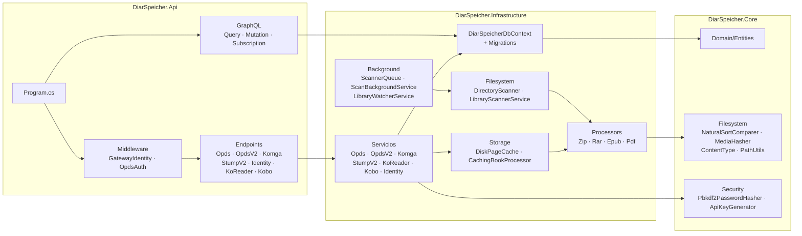
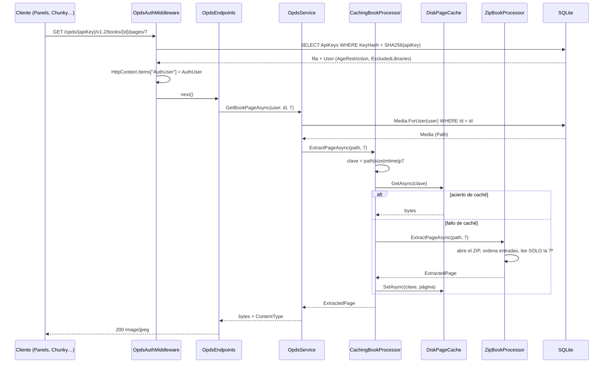

# 01 · Arquitectura

## Qué es el sistema

Un **servidor de medios de lectura** en un solo proceso .NET 10. Indexa directorios del
sistema de ficheros, guarda lo que encuentra en SQLite y sirve el catálogo por varios
protocolos a la vez para que los lectores que ya existen funcionen sin adaptadores.

Todo el diseño está condicionado por el objetivo de correr en una TV box de 4 GB: nunca se
descomprime un cómic entero en memoria, no se rehace el escaneo de lo que no ha cambiado, y
el trabajo de descompresión se paga una vez y se guarda en disco.

## Los tres proyectos

| Proyecto                  | Referencias           | Contenido                                                                        |
| ------------------------- | --------------------- | -------------------------------------------------------------------------------- |
| `DiarSpeicher.Core`       | solo `Ulid`           | Entidades, enums, DTOs de cada protocolo, utilidades de ficheros y de seguridad   |
| `DiarSpeicher.Infrastructure` | `Core`            | `DbContext`, escáner, procesadores de formato, caché de páginas, servicios        |
| `DiarSpeicher.Api`        | `Infrastructure`      | `Program.cs`, middlewares, endpoints minimal API, capa GraphQL                    |

La dependencia va en una sola dirección: `Api → Infrastructure → Core`. `Core` no conoce EF
Core ni ASP.NET; es donde vive el dominio y lo que se puede probar sin arrancar nada.



## Program.cs

Todo el arranque cabe en un fichero
([Program.cs](../../src/DiarSpeicher.Api/Program.cs)), sin MVC ni controladores. Lo que
merece atención:

**Dos registros del `DbContext`.** Uno normal, `AddDbContext<DiarSpeicherDbContext>`, y otro
como factoría, `AddDbContextFactory` con `ServiceLifetime.Scoped`. Es redundante por diseño:
los DataLoaders de GraphQL resuelven lotes en paralelo y un `DbContext` no es thread-safe,
así que la capa GraphQL toma un contexto corto por lote de la factoría mientras los endpoints
REST siguen usando el contexto por petición.

**La extracción de páginas siempre pasa por la caché.** `CompositeBookProcessor` se registra
como tipo concreto, y `ICompositeBookProcessor` —el que se inyecta en todas partes— se
resuelve como un `CachingBookProcessor` que lo envuelve. Nadie puede saltarse la caché por
descuido: solo hay una implementación pública de la interfaz.

```csharp
builder.Services.AddSingleton<ICompositeBookProcessor>(sp => new CachingBookProcessor(
    sp.GetRequiredService<CompositeBookProcessor>(),
    sp.GetRequiredService<IPageCache>()));
```

**Los cuatro procesadores se registran como `IBookProcessor`** y `CompositeBookProcessor`
recibe el `IEnumerable<IBookProcessor>` completo: añadir un formato es añadir una clase y una
línea, sin tocar el despachador.

**Migración y PRAGMA al arrancar.** Antes de servir nada se ejecuta
`db.Database.MigrateAsync()` y después `InitializeSqliteWalAsync()`, que aplica
`journal_mode=WAL`, `synchronous=NORMAL` y `temp_store=MEMORY`.

**Dos hosted services**: `ScanBackgroundService`, que consume la cola de escaneos, y
`LibraryWatcherService`, que vigila el sistema de ficheros y encola escaneos por su cuenta.

**Overrides de entorno tras el binding.** `PostConfigure<StorageOptions>` aplica
`DIAR_ENABLE_UPLOAD`, `DIAR_MAX_FILE_UPLOAD_SIZE` y `DIAR_ALLOWED_EXTENSIONS` **después** de
enlazar la sección `Storage`, de modo que una variable puesta explícitamente siempre gana
sobre `appsettings.json`.

## Orden del pipeline

```csharp
app.UseGatewayIdentity();
app.UseOpdsAuth();
// /health
app.UseWebSockets();
app.MapGraphQL();
app.MapIdentityEndpoints();  // ...y el resto de Map*Endpoints()
```

`UseGatewayIdentity` va **primero** a propósito: si el Gateway ya resolvió la identidad y la
inyectó en cabeceras `X-Auth-*`, deja el `AuthUser` en `HttpContext.Items` y `OpdsAuthMiddleware`
lo respeta sin volver a mirar credenciales. Está descrito en
[05-autenticacion-actual.md](05-autenticacion-actual.md).

`/health` es lo único que queda declarado fuera de los prefijos que `OpdsAuthMiddleware`
protege (`/opds`, `/api/v1`, `/api/v2`, `/koreader`, `/kobo`, `/graphql`).

## Flujo de una petición de página



Lo que no ocurre en ese diagrama es lo importante: el archivo nunca se descomprime entero.
`ZipBookProcessor` recorre las entradas para ordenarlas por nombre, pero solo abre el stream
de la entrada pedida.

La clave de caché incluye tamaño y `LastWriteTimeUtc` del fichero
([CachingBookProcessor.BuildKey](../../src/DiarSpeicher.Infrastructure/Storage/CachingBookProcessor.cs)),
así que reemplazar un cómic invalida sus páginas cacheadas sin que nadie tenga que purgar
nada. El análisis (`AnalyzeAsync`) **no** se cachea: solo se ejecuta una vez por fichero,
durante el escaneo.

## Paquetes clave

| Paquete                             | Versión  | Para qué                                                            |
| ----------------------------------- | -------- | -------------------------------------------------------------------- |
| `Microsoft.EntityFrameworkCore.Sqlite` | 10.0.11 | Persistencia; migraciones; `FromSql` para lo que EF no traduce      |
| `HotChocolate.AspNetCore`           | 16.6.4   | Servidor GraphQL, subscriptions en memoria, `AddUploadType`         |
| `HotChocolate.Data.EntityFramework` | 16.6.4   | `UseFiltering` / `UseSorting` / `UseProjections` sobre `IQueryable`  |
| `SharpCompress`                     | 0.50.4   | RAR y CBR — el único formato sin soporte en la BCL                  |
| `PdfPig`                            | 0.1.16   | Recuento de páginas e imágenes embebidas de PDF, 100 % código gestionado |
| `SkiaSharp` + `SkiaSharp.NativeAssets.Linux` | 4.151.2 | Decodificar, redimensionar y re-codificar portadas a WebP    |
| `Ulid`                              | 1.4.1    | Identificadores de `Library`, `Series`, `Media`, `User`, `ApiKey`, `Session` |

ZIP, CBZ y EPUB se manejan con `System.IO.Compression` de la BCL, sin ninguna librería de
terceros: un EPUB es un ZIP, y `ZipFile.OpenReadAsync` de .NET 10 ya expone la API asíncrona
que hacía falta.

PdfPig es puro código gestionado y por eso no hace falta ningún binario nativo para PDF. La
contrapartida está en [03-escaneo-y-medios.md](03-escaneo-y-medios.md): no rasteriza páginas.

## Configuración

`appsettings.json` ([Api/appsettings.json](../../src/DiarSpeicher.Api/appsettings.json))
enlaza a
[StorageOptions](../../src/DiarSpeicher.Infrastructure/Storage/StorageOptions.cs), que agrupa
cuatro bloques anidados:

| Sección               | Clase               | Qué gobierna                                                       |
| --------------------- | ------------------- | ------------------------------------------------------------------- |
| `Storage.RootPath`    | `StorageOptions`    | Raíz de lo que genera el servidor, no de las bibliotecas del usuario |
| `Storage.PageCache`   | `PageCacheOptions`  | Caché de páginas en disco: 2 GiB, entradas de hasta 32 MiB, LRU al 90 % |
| `Storage.Thumbnails`  | `ThumbnailOptions`  | 512 px de ancho máximo, WebP calidad 80, `PreferJpeg` como escape    |
| `Storage.Upload`      | `UploadOptions`     | 1 GiB por petición, 500 MB por fichero, extensiones permitidas       |
| `Storage.Watcher`     | `WatcherOptions`    | Vigilancia activa, debounce de 10 s, `WatchRootsOnly` como escape    |

`ResolveThumbnailsPath()` devuelve **siempre** una ruta absoluta. La razón no es estética:
las rutas de miniatura se persisten en la base de datos, y una ruta relativa al directorio de
trabajo se rompería en cuanto el proceso arrancase desde otro sitio.

`UploadOptions.AllowedExtensions` empieza vacía a propósito, y `ResolveAllowedExtensions()`
cae a `DefaultAllowedExtensions` cuando lo sigue estando. El binding de configuración de
.NET **añade** a una lista en vez de reemplazarla, así que sembrar los valores por defecto en
la propiedad habría duplicado cada extensión en cuanto alguien pusiera una en el JSON.
