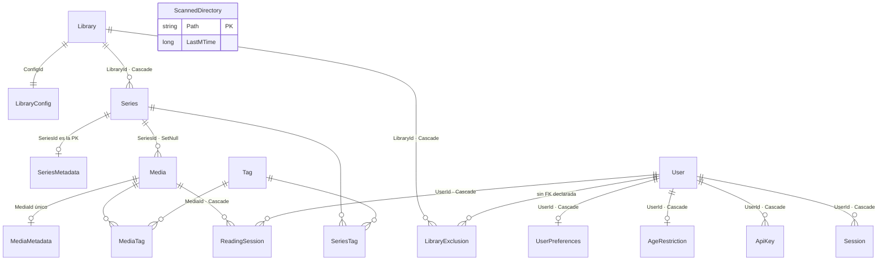

# 02 · Modelo de datos

Una sola base SQLite (`diarspeicher.db` por defecto), 17 tablas, una única migración
(`InitialCreate`). Las entidades viven en
[Core/Domain/Entities](../../src/DiarSpeicher.Core/Domain/Entities) y todo el mapeo está en
un solo `OnModelCreating`, en
[DiarSpeicherDbContext.cs](../../src/DiarSpeicher.Infrastructure/Data/DiarSpeicherDbContext.cs).
No hay clases `IEntityTypeConfiguration` repartidas: el esquema completo se lee de un tirón.

## SQLite en modo WAL

`InitializeSqliteWalAsync()` se ejecuta al arrancar, justo después de aplicar migraciones:

```csharp
PRAGMA journal_mode=WAL;
PRAGMA synchronous=NORMAL;
PRAGMA temp_store=MEMORY;
```

WAL es lo que permite que un escaneo escriba mientras los lectores siguen sirviendo el
catálogo: en el modo rollback por defecto un escritor bloquea a todos los lectores, y un
escaneo de 550 volúmenes dura segundos. `synchronous=NORMAL` renuncia a un `fsync` por
commit —aceptable con WAL— y `temp_store=MEMORY` mantiene los B-tree temporales de ordenación
fuera del disco.

El `PRAGMA` se aplica por conexión, no se persiste en el fichero salvo `journal_mode`, que sí
es una propiedad de la base.

## Diagrama de relaciones



`ScannedDirectory` queda suelta a propósito: no es dominio, es el estado del escáner. Su
clave primaria es la ruta absoluta del directorio y su único campo es el `mtime` Unix de la
última visita. Es lo que hace que un rescan de una biblioteca sin cambios cueste 9 ms en vez
de volver a recorrerla entera.

## Inventario de tablas

| Tabla                | PK                    | Notas del mapeo                                                          |
| -------------------- | --------------------- | ------------------------------------------------------------------------ |
| `Libraries`          | `Id` ULID (32)        | `Status` como string; FK a `LibraryConfig` con `HasForeignKey<Library>`   |
| `LibraryConfigs`     | `Id` INTEGER          | Cinco enums convertidos a string                                          |
| `LibraryExclusions`  | `Id` INTEGER          | `UserId` es `string` sin navegación a `User`; la FK no está declarada     |
| `Series`             | `Id` ULID (32)        | Índices en `LibraryId` y `Path`                                           |
| `SeriesMetadata`     | `SeriesId` ULID (32)  | La PK **es** la FK: no tiene identidad propia                             |
| `Media`              | `Id` ULID (32)        | Seis índices, ver abajo                                                   |
| `MediaMetadata`      | `Id` INTEGER          | `MediaId` con índice único — 1:1 por índice, no por PK compartida         |
| `Tags`               | `Id` INTEGER          | `Name` único                                                              |
| `MediaTags`          | `(MediaId, TagId)`    | Tabla de unión con PK compuesta                                           |
| `SeriesTags`         | `(SeriesId, TagId)`   | Ídem                                                                      |
| `ScannedDirectories` | `Path`                | Caché de mtimes del escáner                                               |
| `ReadingSessions`    | `Id` INTEGER identity | Ver el apartado propio                                                    |
| `Users`              | `Id` ULID (32)        | `Username` único; borrado lógico con `DeletedAt`                          |
| `UserPreferences`    | `Id` INTEGER          | Locale `es` y tema `dark` por defecto                                     |
| `AgeRestrictions`    | `Id` INTEGER          | `Age` + `RestrictOnUnset` (por defecto `true`)                            |
| `ApiKeys`            | `Id` ULID (32)        | `KeyHash` único e indexado — es por donde se busca en cada petición       |
| `Sessions`           | `Id` ULID (32)        | Índices en `UserId` y `ExpiresAt`. Tabla presente, sin uso en el pipeline |

Los identificadores de las entidades de catálogo son **ULID** en columna `TEXT(32)`, no GUID:
son ordenables por tiempo de creación, así que un índice sobre ellos no se fragmenta como lo
haría con un GUID v4, y desempatan de forma estable donde una fecha con la misma marca no lo
haría.

## Índices de `Media`

Seis, y ninguno es decorativo:

| Índice        | Para qué                                                      |
| ------------- | -------------------------------------------------------------- |
| `SeriesId`    | Listar los libros de una serie                                 |
| `Path`        | Reconciliar contra el disco durante un escaneo                 |
| `Hash`        | Deduplicar por el hash parcial estilo Stump                    |
| `KoreaderHash`| Resolver un documento que KOReader identifica solo por su hash |
| `DeletedAt`   | El filtro `DeletedAt IS NULL` está en todas las consultas      |
| `CreatedAt`   | «Últimos libros» ordena por fecha en cada llamada; sin este índice SQLite escanea la tabla y la ordena en un B-tree temporal |

## ReadingSession

La única entidad de catálogo cuya clave **no** es un ULID:

```csharp
public int Id { get; set; }
```

En la migración se traduce a `INTEGER` con `Sqlite:Autoincrement`, es decir un alias de
`rowid`. Se hizo así porque el orden de inserción es el criterio de desempate de «cuál es la
sesión más reciente de este libro», y un entero monótono lo resuelve sin depender de las
marcas de tiempo. Las consultas de progreso lo usan literalmente:

```sql
ROW_NUMBER() OVER (PARTITION BY "MediaId" ORDER BY "Id" DESC)
```

`Status` es un `ReadingStatus` mapeado con `HasConversion<string>()`, así que en la base
aparece como `Reading`, `Finished`, `Abandoned` o `NotStarted`. La conversión a string es
deliberada en **todos** los enums del modelo: un `INTEGER` obliga a mirar el código C# para
saber qué significa un 2, y renumerar el enum corrompería silenciosamente los datos ya
escritos. Con texto, la consulta cruda de
[ReadingSessionSqlQueries](../../src/DiarSpeicher.Infrastructure/Data/Extensions/ReadingSessionSqlQueries.cs)
puede comparar contra `nameof(ReadingStatus.Reading)` y seguir siendo verificable a ojo.

El índice compuesto es `(UserId, MediaId)`: siempre se pregunta por el progreso de **un**
usuario en **un** libro.

## Las dos consultas escritas a mano

EF Core traduce casi todo, pero no traduce un `ORDER BY` sobre `DateTimeOffset` en SQLite,
porque el proveedor lo almacena como texto ISO-8601. En vez de cambiar la representación de
todo el modelo, dos sitios bajan a SQL crudo.

### ROW_NUMBER para el último progreso

[ReadingSessionSqlQueries.cs](../../src/DiarSpeicher.Infrastructure/Data/Extensions/ReadingSessionSqlQueries.cs)
tiene dos métodos, ambos con ventana:

- `GetLatestSessionsPerMediaAsync` — la última sesión de cada libro de una lista, para poder
  pintar el progreso de una página entera de resultados con **una** consulta en vez de N.
  Desempata por `"Id" DESC`.
- `GetKeepReadingSessionsAsync` — la lista de «seguir leyendo»: la última sesión con estado
  `Reading` de cada libro, ordenada por `COALESCE("UpdatedAt", "CreatedAt") DESC`.

Ambas usan `FromSql` interpolado, que EF convierte en parámetros —no en concatenación de
texto— así que el `userId` va enlazado.

### ForUser como SQL

[MediaSqlFilters.cs](../../src/DiarSpeicher.Infrastructure/Data/Extensions/MediaSqlFilters.cs)
expresa las reglas de visibilidad en cláusulas `WHERE` sueltas, con sus joins fijos a
`MediaMetadata`, `Series` y `SeriesMetadata`. Lo usa un único consumidor hoy:
`KomgaService.GetLatestBooksAsync`, que necesita `ORDER BY m."CreatedAt" DESC`.

Dos detalles del diseño:

- `BuildVisibilityFilter` devuelve pares `(nombre, valor)` en vez de `SqliteParameter`. Un
  objeto parámetro no se puede adjuntar a dos comandos, y el conteo total y la página son dos
  consultas distintas; `ToParameters()` crea instancias frescas para cada una.
- Las cláusulas **tienen que** seguir siendo equivalentes a
  [MediaQueryExtensions.ForUser](../../src/DiarSpeicher.Infrastructure/Data/Extensions/MediaQueryExtensions.cs).
  Es una duplicación real, y el riesgo es real: si alguien cambia la regla de restricción por
  edad en un sitio y no en el otro, un libro filtrado en un endpoint se cuela por el de
  «últimos libros». Los tests de
  [ForUserFilterTests.cs](../../tests/DiarSpeicher.Tests/ForUserFilterTests.cs) son la
  defensa.

## ForUser: la regla de visibilidad

[MediaQueryExtensions](../../src/DiarSpeicher.Infrastructure/Data/Extensions/MediaQueryExtensions.cs)
define tres sobrecargas de `ForUser` —sobre `IQueryable<Media>`, `IQueryable<Series>` e
`IQueryable<Library>`— y son transcripciones 1:1 de las funciones equivalentes de Stump
(`media.rs`, `series.rs`, `library.rs`). Tres capas:

1. **Borrado lógico**: `DeletedAt IS NULL` siempre, salvo en `Library`, que no tiene esa
   columna.
2. **Bibliotecas excluidas**: si el usuario tiene filas en `LibraryExclusion`, se descarta lo
   que cuelgue de ellas.
3. **Restricción por edad**: si el libro trae su propia clasificación, se juzga por ella; si
   no, hereda la de la serie. `RestrictOnUnset` decide qué pasa cuando ninguna de las dos
   existe: `true` (el defecto) oculta lo que no está clasificado.

Un `IsServerOwner` cortocircuita las tres reglas.

Esta es **lógica de dominio de medios**, no de identidad: sobrevive intacta al cambio de
autenticación.
