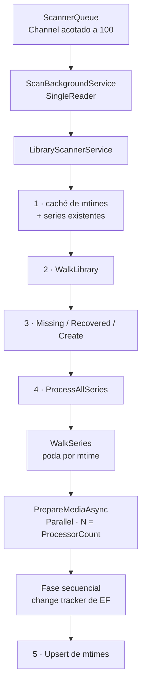
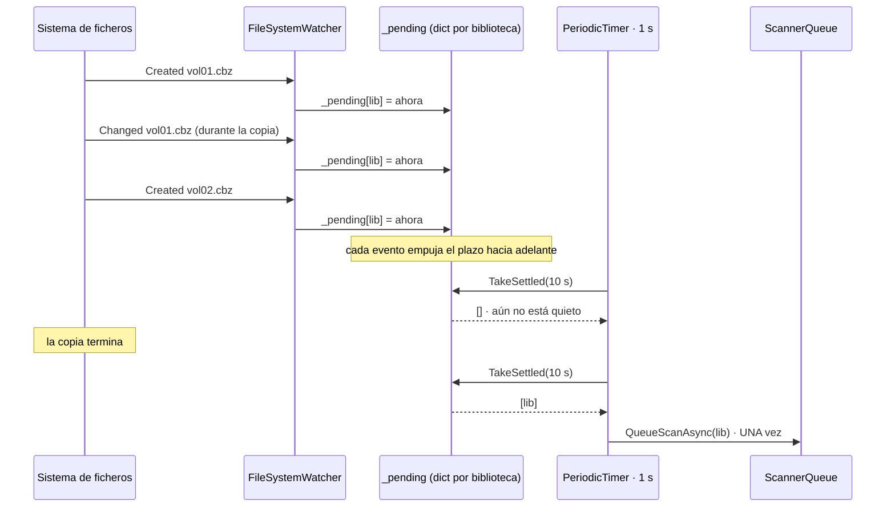

# 03 · Escaneo y motor de medios

## El escaneo en cinco pasos

[LibraryScannerService.ScanLibraryAsync](../../src/DiarSpeicher.Infrastructure/Filesystem/LibraryScannerService.cs)
es el orquestador. Recibe un `libraryId` y hace, en este orden:

1. Cargar la caché de mtimes (`ScannedDirectories` cuya ruta empieza por la de la biblioteca)
   y las series ya conocidas.
2. Recorrer la biblioteca —`DirectoryScanner.WalkLibrary`— para decidir qué directorios son
   series nuevas, cuáles hay que revisitar y cuáles han desaparecido.
3. Reconciliar: marcar `Missing` lo que ya no está, devolver a `Ready` lo que ha reaparecido,
   crear las series nuevas.
4. Recorrer cada serie y procesar sus ficheros.
5. Persistir en bloque los mtimes observados.



Un escaneo completo de 550 volúmenes tarda **2,3 s** con el RSS estable en 658-659 MB. El
rescan de esa misma biblioteca sin cambios cuesta **9 ms**: la poda por mtime evita abrir
ningún archivo.

## La caché de mtimes

`ScannedDirectory` guarda, por ruta absoluta de directorio, el `mtime` Unix de la última
visita.
[DirectoryScanner.TraverseSeriesDirectories](../../src/DiarSpeicher.Infrastructure/Filesystem/DirectoryScanner.cs)
compara el de disco con el cacheado y, si coinciden, **corta la recursión ahí mismo**: no
lista los ficheros, no baja a los subdirectorios.

Con una excepción: **la raíz de la serie nunca se salta**, aunque su mtime no haya cambiado.
Es la regla que hereda de Stump, y tiene motivo: modificar un fichero dentro de un
subdirectorio no siempre toca el mtime del directorio padre, así que la raíz se recorre
siempre para no perder un cambio ocurrido dos niveles más abajo.

Solo se apuntan en `observedMtimes` los directorios que **sí** cambiaron. Los que se podan
conservan su valor anterior, que sigue siendo correcto.

El segundo nivel de poda es por fichero: para un `Media` ya conocido se compara
`File.GetLastWriteTimeUtc` contra la columna `ModifiedAt`, y solo se vuelve a analizar si el
disco es más nuevo.

## Fase paralela y fase secuencial

`PrepareMediaAsync` es la única parte que se reparte entre núcleos, con
`MaxDegreeOfParallelism = Environment.ProcessorCount`:

```csharp
var analyzed = await _bookProcessor.AnalyzeAsync(mediaPath, includeCover: true, token);
var thumbPath = await _thumbnailService.SaveThumbnailAsync(mediaId, analyzed.Cover, thumbnailsDir, token);
```

Abrir el archivo, descomprimirlo, hashearlo y codificar la miniatura es trabajo de CPU y no
toca `DbContext`. Escribir las entidades **sí**, y por eso el bucle que las añade al change
tracker viene después, secuencial: `DbContext` no es thread-safe y un solo hilo lo escribe.

`includeCover: true` es lo que evita abrir el archivo dos veces. Sin él habría que
descomprimir el cómic entero para los metadatos y volver a abrirlo para la portada.

Un libro que falla al procesarse se registra en el log y se descarta; no aborta el lote.

## FileSystemWatcher con debouncing

[LibraryWatcherService](../../src/DiarSpeicher.Infrastructure/Background/LibraryWatcherService.cs)
monta un `FileSystemWatcher` por biblioteca al arrancar y encola escaneos por su cuenta.



Tres decisiones que importan:

- **El plazo se reinicia con cada evento**, no se fija con el primero. Copiar veinte
  volúmenes encola **un** escaneo, y ese escaneo empieza cuando la copia lleva 10 s quieta.
  Escanear un `.cbz` a medio escribir da un archivo corrupto y un libro con 0 páginas.
- **El filtro `IsRelevant`** descarta ficheros ocultos y extensiones que no están en
  `PathUtils.AcceptedMediaExtensions`. Los directorios siempre pasan.
- **Degradación ante `inotify` agotado.** La vigilancia recursiva de una biblioteca con miles
  de directorios agota `fs.inotify.max_user_watches`. Cuando `IncludeSubdirectories = true`
  lanza `IOException`, `TryCreateWatcher` reintenta **sin** recursión, avisa por log de que
  los ficheros nuevos en subdirectorios ya no dispararán un escaneo, y dice qué sysctl subir.
  `WatcherOptions.WatchRootsOnly` permite elegir ese modo desde el principio.

El bucle de barrido usa un `PeriodicTimer` de 1 s en vez de un `Timer` por biblioteca:
un solo temporizador para todas.

## Procesadores por formato

Cuatro implementaciones de `IBookProcessor`, tres de ellas en
[BookProcessors.cs](../../src/DiarSpeicher.Infrastructure/Filesystem/Processors/BookProcessors.cs)
y el PDF en
[PdfBookProcessor.cs](../../src/DiarSpeicher.Infrastructure/Filesystem/Processors/PdfBookProcessor.cs):

| Procesador          | Extensiones     | Librería                       | Páginas                      | Hash Stump | Hash KOReader |
| ------------------- | --------------- | ------------------------------ | ---------------------------- | ---------- | ------------- |
| `ZipBookProcessor`  | `.cbz` `.zip`   | `System.IO.Compression`        | entradas de imagen           | sí         | no            |
| `RarBookProcessor`  | `.cbr` `.rar`   | SharpCompress                  | entradas de imagen           | sí         | no            |
| `EpubBookProcessor` | `.epub`         | `System.IO.Compression` + `XDocument` | `itemref` del spine   | sí         | sí            |
| `PdfBookProcessor`  | `.pdf`          | PdfPig                         | `NumberOfPages`              | no         | no            |

`CompositeBookProcessor` despacha por extensión con el primer procesador que responde
`CanProcess`. Si ninguno lo hace, devuelve `Pages = 0` pero **sí** calcula ambos hashes: un
fichero desconocido sigue siendo identificable.

Un EPUB es un ZIP, así que no hace falta ninguna librería específica. El `.opf` se localiza
por `META-INF/container.xml` y, si falta, por la primera entrada `.opf` del archivo.

El hash de KOReader solo se calcula para EPUB y para lo desconocido, no para los cómics: es
el algoritmo que KOReader usa para identificar un documento, y KOReader lee EPUB.

### Los dos hashes

[MediaHasher](../../src/DiarSpeicher.Core/Filesystem/MediaHasher.cs) implementa los dos
algoritmos de Stump, ambos por muestreo:

- **Stump SHA-256**: cuatro bloques de 10 000 bytes a offsets equidistantes, más los últimos
  10 000. Identificar un fichero de 500 MB cuesta leer 50 KB. Si el fichero cabe en esos
  40 000 bytes se hashea entero.
- **KOReader MD5**: bloques de 1 KiB en offsets `1024 << (2i)` para `i` de -1 a 10, es decir
  crecimiento exponencial. Es un puerto del `util.lua` de KOReader; tiene que coincidir
  bit a bit o la sincronización de progreso no encuentra el documento.

## Orden natural

[NaturalSortComparer](../../src/DiarSpeicher.Core/Filesystem/NaturalSortComparer.cs) decide en
qué orden salen las páginas. Es el componente que más se ejecuta de todo el escáner: se llama
una vez por archivo abierto, sobre todas sus entradas.

La implementación se apoya en **`CompareOptions.NumericOrdering`**, nuevo en .NET 10:

```csharp
StringComparer.Create(CultureInfo.InvariantCulture, CompareOptions.NumericOrdering | CompareOptions.IgnoreCase)
```

Con eso `page2` va antes que `page10` sin recorrer las tiradas de dígitos a mano. Medido
sobre 3000 entradas:

| Implementación                      | Tiempo   |
| ----------------------------------- | -------- |
| .NET 10 `NumericOrdering`           | 4,13 ms  |
| Implementación manual previa        | 8,28 ms  |
| `NaturalSort.Extension`             | 17,52 ms |

Dos decisiones que `NumericOrdering` por sí solo no resuelve.

**Comparación por componente de ruta.** El comparador parte por `/` y `\` y compara segmento
a segmento. Sobre la cadena completa, `cap1/p2` cae **entre** las páginas de `cap01`,
intercalando dos capítulos distintos. Por componentes, cada nivel se resuelve antes de mirar
el siguiente, y `cap1/p2.jpg` sale antes que todo `cap01/`.

**Desempate por longitud del segmento.** `NumericOrdering` considera `cap1` y `cap01`
**iguales** —mismo valor numérico—, así que una diferencia de relleno por sí sola caería al
siguiente componente y volvería a intercalar dos directorios que no son el mismo. Cuando el
comparador numérico devuelve 0 pero las cadenas no son iguales ignorando mayúsculas, gana el
segmento **más corto**:

```csharp
return x.Length != y.Length
    ? x.Length.CompareTo(y.Length)
    : string.CompareOrdinal(x, y);
```

Para segmentos que solo difieren en el relleno, eso es exactamente «menos dígitos primero»,
que es como se escribe cuando un lote mezcla ambas formas.

Los tests que fijan este comportamiento están en
[NaturalSortTests.cs](../../tests/DiarSpeicher.Tests/NaturalSortTests.cs).

## Selección de portada

La primera imagen por orden alfabético no siempre es la portada. `ComicInfo.xml` puede
declararla con `Type="FrontCover"`, y
[ComicInfoParser](../../src/DiarSpeicher.Infrastructure/Filesystem/Metadata/ComicInfoParser.cs)
la extrae como índice base 0 en `ExtractedMetadata.FrontCoverIndex`.

`CoverSelection.SelectCoverIndex` aplica la regla completa:

```csharp
return declared is >= 0 && declared < pageCount ? declared.Value : 0;
```

Es decir: se respeta lo que declara el archivo, salvo que el índice caiga fuera del rango real
de imágenes, en cuyo caso se vuelve a la primera. Un `ComicInfo.xml` que miente no rompe el
escaneo. Los casos están cubiertos en
[FrontCoverTests.cs](../../tests/DiarSpeicher.Tests/FrontCoverTests.cs).

Para EPUB la búsqueda es distinta y va en tres intentos:
`<item properties="cover-image">` (EPUB 3), luego `<meta name="cover" content="id">` resuelto
contra el `<item id="...">` (EPUB 2), y como último recurso la primera imagen cuyo nombre
contenga «cover».

## Miniaturas

[ThumbnailService](../../src/DiarSpeicher.Infrastructure/Filesystem/Thumbnails/ThumbnailService.cs)
recibe la portada ya extraída, la reduce con SkiaSharp y la escribe en
`<RootPath>/thumbnails/<mediaId>.<ext>`.

- Redimensiona a `ThumbnailOptions.MaxWidth` (512 px por defecto) conservando la proporción,
  con remuestreo cúbico Mitchell.
- **Nunca escala hacia arriba**: si la portada ya es más estrecha que el objetivo, `Downscale`
  devuelve `null` y se codifica el original. Ampliar solo infla el fichero.
- Codifica a **WebP** calidad 80. `PreferJpeg` cambia a JPEG para clientes que no entienden
  WebP.
- Si SkiaSharp no puede decodificar la imagen, `Fallback` escribe los bytes **originales tal
  cual** con la extensión que corresponda al tipo detectado. Preferible a fallar el escaneo
  por un formato raro, pero con la consecuencia que se explica abajo.

El servicio expone dos métodos: `SaveThumbnailAsync`, que recibe la portada ya extraída y es
el que usa el escáner, y `GenerateThumbnailAsync`, que la extrae él mismo. Este segundo pide
la **página 1**, no la portada declarada en `ComicInfo.xml`: si algún consumidor lo usa sobre
un cómic cuyo `FrontCover` no es la primera imagen, obtiene una miniatura distinta a la que
generó el escaneo.

## Limitaciones conocidas

### JXL no se redimensiona

SkiaSharp **no decodifica JPEG XL**. `SKBitmap.Decode` devuelve `null`, entra la rama
`Fallback` y la portada se escribe **sin redimensionar**, con su tamaño original — 111 KB en
la medición hecha, frente a los pocos KB que daría un WebP de 512 px.

Es una **regresión** frente a la implementación anterior con ImageSharp, que sí lo manejaba.
El fichero se sirve y la biblioteca se ve, pero un cliente que pinte una rejilla de portadas
JXL descarga imágenes a resolución completa.

### PDF de solo texto: cuenta páginas, no genera portada

`PdfBookProcessor` **no rasteriza**. Extrae las imágenes ya embebidas en la página y escoge
la de mayor área en píxeles, que en un cómic o libro escaneado es la página entera. Además,
solo sirve las que puede entregar sin recodificar: PNG vía `TryGetPng`, y JPEG cuando los
bytes crudos empiezan por `FF D8 FF`. Cualquier otra codificación se descarta antes que
servir un blob ilegible.

La consecuencia es directa: un PDF compuesto de texto y fuentes —no de imágenes escaneadas—
reporta correctamente su número de páginas y sus metadatos (`Title`, `Author`, `Subject`),
pero **no genera portada**. `GetImages()` no devuelve nada, `ExtractLargestImage` devuelve
`null`, y el libro aparece en el catálogo sin miniatura.

Rasterizar exigiría un motor de renderizado nativo, que es justo lo que PdfPig permite evitar.
Es un intercambio consciente: sin binarios nativos, sin portada para PDF vectorial.

### Otras

- Un archivo corrupto se captura en silencio dentro de `AnalyzeBookAsync` y el libro queda
  con `Pages = 0`. No se marca `FileStatus.Error`, así que en el catálogo aparece igual que
  uno vacío legítimo.
- `EpubBookProcessor.ExtractPageAsync` devuelve **siempre la portada**, sea cual sea el número
  de página pedido. La lectura real de EPUB se hace por los endpoints `/api/v2/epub/{id}/toc`
  y `/api/v2/epub/{id}/resource/{*path}`, no por el extractor de páginas.
- El recuento de páginas de un EPUB son capítulos (`itemref` del spine), no páginas
  renderizadas. No hay forma de saber las segundas sin paginar el contenido en el cliente.
