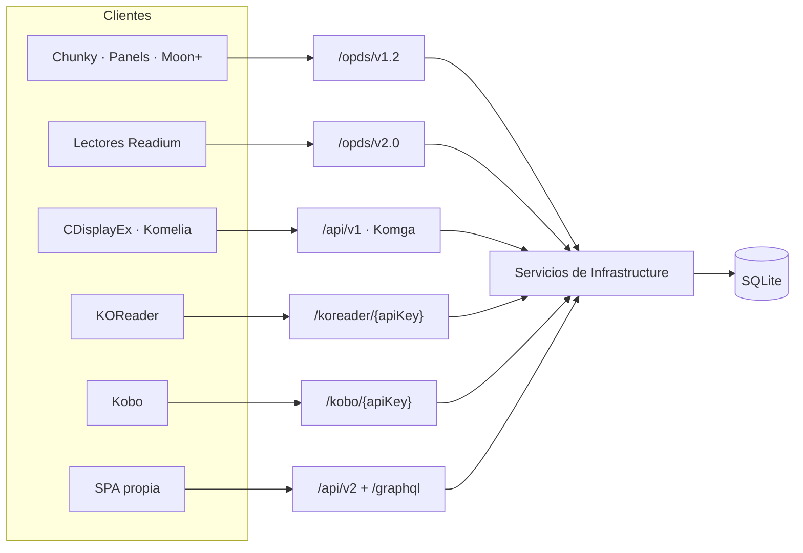

# 04 · APIs y protocolos

Seis superficies HTTP más GraphQL, todas sobre las mismas tablas. La razón de que haya tantas
no es indecisión: cada lector de e-books habla el protocolo que habla, y el objetivo del
proyecto es que funcionen sin adaptadores.



Todos los endpoints resuelven el usuario desde `HttpContext.Items["AuthUser"]`, que deja
`OpdsAuthMiddleware` o `GatewayIdentityMiddleware`, y filtran con `ForUser` antes de devolver
nada.

## OPDS v1.2 — `/opds/v1.2`

[OpdsEndpoints.cs](../../src/DiarSpeicher.Api/Endpoints/OpdsEndpoints.cs) ·
[OpdsService.cs](../../src/DiarSpeicher.Infrastructure/Opds/OpdsService.cs) ·
[OpdsXmlBuilder.cs](../../src/DiarSpeicher.Infrastructure/Opds/OpdsXmlBuilder.cs)

Feeds Atom XML. El grupo se registra **dos veces**: como `/opds/v1.2/...` y como
`/opds/{apiKey}/v1.2/...`, con los mismos handlers. La variante con la clave en la ruta existe
porque hay lectores clásicos que no permiten configurar cabeceras.

| Ruta                          | Devuelve                                                    |
| ----------------------------- | ------------------------------------------------------------ |
| `GET /catalog`                | Feed raíz de navegación                                       |
| `GET /search`                 | Descriptor OpenSearch                                         |
| `GET /search/feed`            | Resultados de búsqueda                                        |
| `GET /keep-reading`           | Libros con sesión en curso                                    |
| `GET /libraries`              | Feed de bibliotecas                                           |
| `GET /libraries/{id}`         | Series de una biblioteca                                      |
| `GET /series`                 | Todas las series                                              |
| `GET /series/latest`          | Series recientes                                              |
| `GET /series/{id}`            | Libros de una serie                                           |
| `GET /books`                  | Todos los libros                                              |
| `GET /books/latest`           | Libros recientes                                              |
| `GET /books/{id}/thumbnail`   | Miniatura                                                     |
| `GET /books/{id}/pages/{page}`| Una página como imagen                                        |
| `GET /books/{id}/file`        | Descarga del archivo original                                 |
| `GET /books/{id}/file/{filename}` | Lo mismo, con nombre en la URL para clientes que lo exigen |

## OPDS v2.0 — `/opds/v2.0`

[OpdsV2Endpoints.cs](../../src/DiarSpeicher.Api/Endpoints/OpdsV2Endpoints.cs) ·
[OpdsV2Service.cs](../../src/DiarSpeicher.Infrastructure/Opds/OpdsV2Service.cs)

JSON-LD estilo Readium / WebPub. Mismo doble registro con `{apiKey}`.

| Ruta                              | Devuelve                                              |
| --------------------------------- | ------------------------------------------------------ |
| `GET /auth`                       | Authentication Document (`application/opds-authentication+json`) |
| `GET /catalog`                    | Feed raíz                                              |
| `GET /search?query=`              | Búsqueda                                               |
| `GET /libraries`                  | Bibliotecas                                            |
| `GET /libraries/{id}?page=`       | Series de la biblioteca, paginado                      |
| `GET /series?page=`               | Series                                                 |
| `GET /series/{id}?page=`          | Libros de la serie                                     |
| `GET /books/browse?page=`         | Catálogo de libros                                     |
| `GET /books/latest?page=`         | Recientes                                              |
| `GET /books/keep-reading`         | En curso                                               |
| `GET /books/{id}`                 | Publicación                                            |
| `GET /books/{id}/thumbnail`       | Miniatura                                              |
| `GET /books/{id}/pages/{page}`    | Página                                                 |
| `GET /books/{id}/progression`     | Progreso de lectura                                    |
| `PUT /books/{id}/progression`     | Actualiza el progreso                                  |
| `GET /books/{id}/file`            | Descarga                                               |

## API Komga — `/api/v1`

[KomgaEndpoints.cs](../../src/DiarSpeicher.Api/Endpoints/KomgaEndpoints.cs) ·
[KomgaService.cs](../../src/DiarSpeicher.Infrastructure/Komga/KomgaService.cs)

Réplica de la API REST de Komga para que los clientes que ya la hablan funcionen sin cambios.
Las respuestas paginadas usan `KomgaPageResponse<T>`, que imita el `Page<T>` de Spring
(`content`, `totalElements`, `totalPages`, `number`, `size`).

| Ruta                                | Método | Función                                    |
| ----------------------------------- | ------ | -------------------------------------------- |
| `/libraries`                        | GET    | Bibliotecas visibles                        |
| `/libraries/{id}`                   | GET    | Una biblioteca                              |
| `/series`                           | GET    | Series, con `library_id` y `search`         |
| `/series/{id}`                      | GET    | Una serie                                   |
| `/series/{id}/books`                | GET    | Libros de la serie, paginado                |
| `/series/{id}/thumbnail`            | GET    | Miniatura de la serie                       |
| `/books`                            | GET    | Libros, con `search`                        |
| `/books/latest`                     | GET    | Recientes — el único que baja a SQL crudo   |
| `/books/{id}`                       | GET    | Un libro                                    |
| `/books/{id}/pages`                 | GET    | Lista de páginas                            |
| `/books/{id}/pages/{pageNumber}`    | GET    | Una página                                  |
| `/books/{id}/thumbnail`             | GET    | Miniatura                                   |
| `/books/{id}/file`                  | GET    | Descarga                                    |
| `/books/{id}/read-progress`         | PATCH  | Actualiza el progreso                       |
| `/books/{id}/read-progress`         | DELETE | Borra el progreso                           |

`GET /books/latest` es el único que usa
[MediaSqlFilters](../../src/DiarSpeicher.Infrastructure/Data/Extensions/MediaSqlFilters.cs):
necesita `ORDER BY CreatedAt DESC` y EF no traduce un `ORDER BY` sobre `DateTimeOffset` en
SQLite. El resto de la API se resuelve con LINQ y `ForUser`.

## API v2 nativa — `/api/v2`

Lo sirve [StumpV2Endpoints.cs](../../src/DiarSpeicher.Api/Endpoints/StumpV2Endpoints.cs).
Los endpoints de usuarios y claves que compartían este prefijo se retiraron:
esa administración es del plugin del Gateway.

### Sistema

| Ruta            | Método | Función                                            |
| --------------- | ------ | ---------------------------------------------------- |
| `/ping`         | GET    | `"pong"`                                            |
| `/health`       | GET    | Estado del servicio                                 |
| `/version`      | GET    | `{ semver: "0.1.0", rev: "net10" }` — constante     |
| `/claim`        | GET    | Si el servidor ya tiene dueño                       |
| `/claim`        | POST   | Reclama el servidor y crea el primer usuario        |
| `/auth/me`      | GET    | El `AuthUser` resuelto                              |

### Catálogo

| Ruta                          | Método | Función                                              |
| ----------------------------- | ------ | ------------------------------------------------------ |
| `/media`                      | GET    | Libros                                                |
| `/media/keep-reading`         | GET    | En curso                                              |
| `/media/{id}`                 | GET    | Un libro                                              |
| `/media/{id}/page/{page}`     | GET    | Una página                                            |
| `/media/{id}/thumbnail`       | GET    | Miniatura                                             |
| `/media/{id}/file`            | GET    | Descarga                                              |
| `/media/{id}/progress`        | PUT    | Actualiza el progreso                                 |
| `/series`                     | GET    | Series                                                |
| `/series/{id}`                | GET    | Una serie                                             |
| `/series/{id}/media`          | GET    | Libros de la serie                                    |
| `/libraries`                  | GET    | Bibliotecas                                           |
| `/libraries/{id}`             | GET    | Una biblioteca                                        |
| `/libraries`                  | POST   | Crea una biblioteca                                   |
| `/libraries/{id}/upload`      | POST   | Subida multipart · `DisableAntiforgery()`             |
| `/libraries/{id}/scan`        | POST   | Encola un escaneo · `202 Accepted`                    |
| `/epub/{id}/toc`              | GET    | Índice del EPUB                                       |
| `/epub/{id}/resource/{*path}` | GET    | Un recurso interno del EPUB · `Cache-Control: 86400`  |

Los dos endpoints de EPUB son los que hacen posible leer un EPUB en el navegador: `toc`
devuelve la estructura y `resource` sirve cada capítulo, hoja de estilo o imagen por su ruta
dentro del ZIP. `ExtractPageAsync` sobre un EPUB no sirve para eso — siempre devuelve la
portada.

### Subida de ficheros

`HandleLibraryUpload` sube los límites **en la propia petición**, no de forma global. Kestrel
tope los cuerpos en 30 MB y los multipart en 128 MB por defecto, cifras por debajo de un
volumen de cómic:

```csharp
sizeFeature.MaxRequestBodySize = maxUploadBytes;
httpContext.Features.Set<IFormFeature>(new FormFeature(httpContext.Request, new FormOptions
{
    MultipartBodyLengthLimit = maxUploadBytes,
    ValueLengthLimit = int.MaxValue
}));
```

Se hace por petición y no en `Program.cs` para que el límite alto aplique solo al endpoint que
lo necesita. El resto de la API conserva los topes por defecto.

Los códigos de salida los decide el `UploadOutcome` del servicio: `403` si las subidas están
desactivadas, `404` si la biblioteca no existe, `413` si un fichero supera
`MaxFileUploadSize`, `400` para el resto.

### Identidad

| Ruta                              | Método | Función                                  |
| --------------------------------- | ------ | ------------------------------------------ |
| `/claim`                          | POST   | Crea el primer usuario (dueño del servidor) |
| `/users`                          | GET    | Lista de usuarios                         |
| `/users`                          | POST   | Crea un usuario                           |
| `/users/{id}`                     | PUT    | Contraseña, bloqueo, sesiones máximas     |
| `/users/{id}`                     | DELETE | Borrado lógico                            |
| `/users/{id}/api-keys`            | GET    | Claves del usuario (sin el texto plano)   |
| `/users/{id}/api-keys`            | POST   | Genera una clave · devuelve el plano una sola vez |
| `/users/{id}/api-keys/{keyId}`    | DELETE | Revoca una clave                          |

Detallado en [05-autenticacion-actual.md](05-autenticacion-actual.md).

## KOReader Sync — `/koreader/{apiKey}`

[KoReaderEndpoints.cs](../../src/DiarSpeicher.Api/Endpoints/KoReaderEndpoints.cs) ·
[KoReaderService.cs](../../src/DiarSpeicher.Infrastructure/Sync/KoReaderService.cs)

| Ruta                          | Método | Función                                              |
| ----------------------------- | ------ | ------------------------------------------------------ |
| `/users/auth`                 | GET    | Devuelve `{"authorized":"OK"}`                        |
| `/users/create`               | GET    | Igual que el anterior                                 |
| `/syncs/progress/{document}`  | GET    | Progreso del documento identificado por su hash       |
| `/syncs/progress`             | PUT    | Guarda el progreso                                    |

`{document}` **es el hash MD5 de KOReader**, no un id de la base. El lector no conoce los ids
del servidor: identifica el fichero por su propio algoritmo, y por eso `Media.KoreaderHash`
existe e indexa.

`/users/create` no crea nada: responde lo mismo que `/users/auth` porque el cliente de
KOReader lo llama durante la configuración y espera un `200`. La autenticación real ya la
resolvió el middleware con la clave de la ruta.

## Kobo Sync — `/kobo/{apiKey}`

[KoboEndpoints.cs](../../src/DiarSpeicher.Api/Endpoints/KoboEndpoints.cs) ·
[KoboService.cs](../../src/DiarSpeicher.Infrastructure/Sync/KoboService.cs)

| Ruta                                                          | Método | Función                     |
| ------------------------------------------------------------- | ------ | ----------------------------- |
| `/v1/initialization`                                          | GET    | Endpoints que el dispositivo debe usar |
| `/v1/library/sync`                                            | GET    | Sincronización incremental por token |
| `/v1/library/{bookId}/metadata`                               | GET    | Metadatos de un libro       |
| `/v1/books/{bookId}/thumbnail/{width}/{height}/{isGreyscale}/image.jpg` | GET | Miniatura       |
| `/v1/books/{bookId}/thumbnail/{width}/{height}/{quality}/{isGreyscale}/image.jpg` | GET | Miniatura, variante con calidad |
| `/v1/books/{bookId}/file/epub`                                | GET    | Descarga del EPUB           |

Las dos rutas de miniatura existen porque el firmware de Kobo usa una u otra según la versión;
ambas apuntan al mismo handler.

## GraphQL — `/graphql`

[Queries.cs](../../src/DiarSpeicher.Api/GraphQL/Queries.cs) ·
[Mutations.cs](../../src/DiarSpeicher.Api/GraphQL/Mutations.cs) ·
[Subscriptions.cs](../../src/DiarSpeicher.Api/GraphQL/Subscriptions.cs) ·
[NodeResolvers.cs](../../src/DiarSpeicher.Api/GraphQL/NodeResolvers.cs)

HotChocolate 16.6.4, con `AddFiltering`, `AddSorting` y `AddProjections` sobre los
`IQueryable` ya filtrados por `ForUser`.

| Tipo         | Miembros                                                                        |
| ------------ | --------------------------------------------------------------------------------- |
| Query        | `libraries`, `series`, `media`, `readingSessions` (todos con `UsePaging`), `serverConfig` |
| Mutation     | `createLibrary`, `editLibrary`, `deleteLibrary`, `scanLibrary`, `updateReadingProgress`, `uploadBooks` |
| Subscription | `jobProgress(jobId)`                                                            |

### DataLoaders

Cuatro, registrados en `Program.cs`: `MediaBySeriesDataLoader`, `SeriesByLibraryDataLoader`,
`SeriesByIdDataLoader` y `LibraryByIdDataLoader`. Son la diferencia entre una consulta
razonable y N+1: **14 series con sus medios anidados se resuelven en 3 consultas SQL**.

Cada DataLoader toma un `DbContext` corto de la factoría, porque los lotes se resuelven en
paralelo y un contexto compartido no lo soportaría. Es la razón de que `Program.cs` registre
el contexto dos veces.

### Subscriptions

El escáner publica `ScanProgressEvent` a través de `IScanProgressPublisher`, y
`GraphQLScanProgressPublisher` los envía al pub/sub en memoria de HotChocolate. El topic es
`jobProgress:{jobId}` y el `jobId` **es el id de la biblioteca**, de modo que un cliente que
acaba de lanzar un escaneo ya conoce el identificador al que suscribirse sin esperar respuesta.

Publicar no puede tumbar un escaneo: `PublishAsync` traga la excepción tras registrarla en el
log. Un cliente que se desconecta no interrumpe la indexación.

`app.UseWebSockets()` está antes de `MapGraphQL()` porque las subscriptions lo necesitan.

## Endpoints fuera de todo grupo

Declarados directamente en [Program.cs](../../src/DiarSpeicher.Api/Program.cs):

| Ruta      | Método | Nota                               |
| --------- | ------ | ---------------------------------- |
| `/health` | GET    | Estado, versión y modo de la base  |

`/health` es la única ruta declarada fuera de los prefijos que `OpdsAuthMiddleware`
protege (`/opds`, `/api/v1`, `/api/v2`, `/koreader`, `/kobo`, `/graphql`), y no devuelve
nada sensible.

Existía además un `POST /api/libraries/{id}/scan` declarado a mano que caía fuera de esos
prefijos y encolaba escaneos sin credencial. Se retiró: duplicaba
`POST /api/v2/libraries/{id}/scan`, que sí autentica y comprueba permisos.
