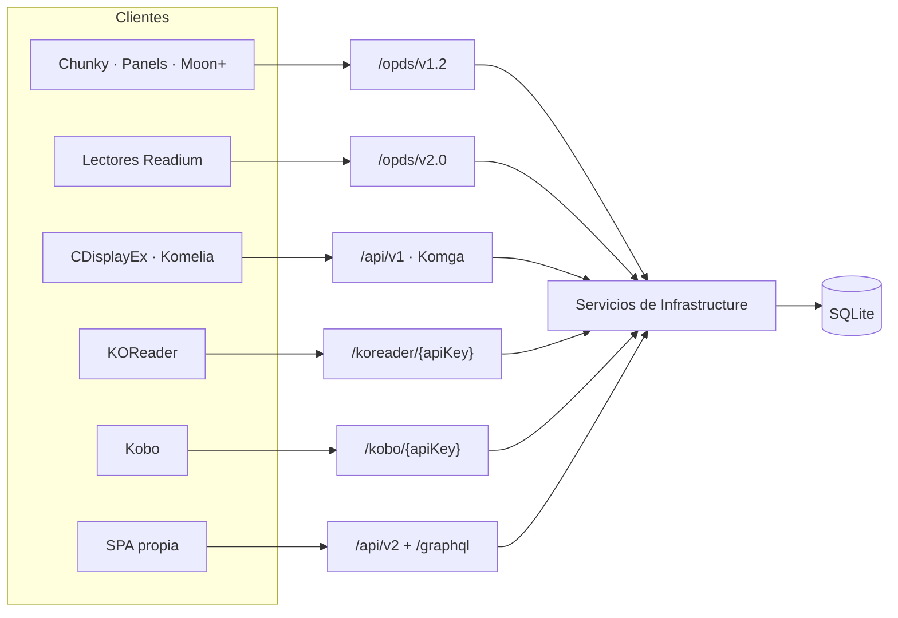

# 04 · APIs y protocolos

Seis superficies HTTP más GraphQL, todas sobre las mismas tablas. La razón de que haya tantas
no es indecisión: cada lector de e-books habla el protocolo que habla, y el objetivo del
proyecto es que funcionen sin adaptadores.



Todos los endpoints resuelven el usuario desde `HttpContext.Items["AuthUser"]`, que deja
`OpdsAuthMiddleware` o `GatewayIdentityMiddleware`, y filtran con `ForUser` antes de devolver
nada.

## OPDS v1.2 — `/opds/v1.2`

[OpdsEndpoints.cs](../../src/DiarSpeicher.Api/Endpoints/OpdsEndpoints.cs) ·
[OpdsService.cs](../../src/DiarSpeicher.Infrastructure/Opds/OpdsService.cs) ·
[OpdsXmlBuilder.cs](../../src/DiarSpeicher.Infrastructure/Opds/OpdsXmlBuilder.cs)

Feeds Atom XML. El grupo se registra **dos veces**: como `/opds/v1.2/...` y como
`/opds/{apiKey}/v1.2/...`, con los mismos handlers. La variante con la clave en la ruta existe
porque hay lectores clásicos que no permiten configurar cabeceras.

| Ruta                          | Devuelve                                                    |
| ----------------------------- | ------------------------------------------------------------ |
| `GET /catalog`                | Feed raíz de navegación                                       |
| `GET /search`                 | Descriptor OpenSearch                                         |
| `GET /search/feed`            | Resultados de búsqueda                                        |
| `GET /keep-reading`           | Libros con sesión en curso                                    |
| `GET /libraries`              | Feed de bibliotecas                                           |
| `GET /libraries/{id}`         | Series de una biblioteca                                      |
| `GET /series`                 | Todas las series                                              |
| `GET /series/latest`          | Series recientes                                              |
| `GET /series/{id}`            | Libros de una serie                                           |
| `GET /books`                  | Todos los libros                                              |
| `GET /books/latest`           | Libros recientes                                              |
| `GET /books/{id}/thumbnail`   | Miniatura                                                     |
| `GET /books/{id}/pages/{page}`| Una página como imagen                                        |
| `GET /books/{id}/file`        | Descarga del archivo original                                 |
| `GET /books/{id}/file/{filename}` | Lo mismo, con nombre en la URL para clientes que lo exigen |

## OPDS v2.0 — `/opds/v2.0`

[OpdsV2Endpoints.cs](../../src/DiarSpeicher.Api/Endpoints/OpdsV2Endpoints.cs) ·
[OpdsV2Service.cs](../../src/DiarSpeicher.Infrastructure/Opds/OpdsV2Service.cs)

JSON-LD estilo Readium / WebPub. Mismo doble registro con `{apiKey}`.

**El grupo se registra bajo dos prefijos**, `/opds/v2.0` y `/opds/v2`. El segundo es el que
usa Komga (`Opds2Controller.kt`: `@RequestMapping(value = ["/opds/v2/"])`), y sin él un cliente
escrito contra Komga recibe un 404. Con `{apiKey}` son cuatro registros en total.

Komga además cuelga varios feeds de `libraries/` en lugar de `books/`, así que esos cuatro
tienen alias hacia el mismo handler:

| Ruta de Komga              | Alias de                |
| -------------------------- | ----------------------- |
| `libraries/browse`         | `books/browse`          |
| `libraries/books/latest`   | `books/latest`          |
| `libraries/keep-reading`   | `books/keep-reading`    |
| `libraries/{id}/browse`    | `libraries/{id}`        |

No existen equivalentes de `libraries/on-deck`, `libraries/series/latest`, `collections/{id}`
ni `readlists/{id}`: colecciones y listas de lectura no son entidades del modelo.

| Ruta                              | Devuelve                                              |
| --------------------------------- | ------------------------------------------------------ |
| `GET /auth`                       | Authentication Document (`application/opds-authentication+json`) |
| `GET /catalog`                    | Feed raíz                                              |
| `GET /search?query=`              | Búsqueda                                               |
| `GET /libraries`                  | Bibliotecas                                            |
| `GET /libraries/{id}?page=`       | Series de la biblioteca, paginado                      |
| `GET /series?page=`               | Series                                                 |
| `GET /series/{id}?page=`          | Libros de la serie                                     |
| `GET /books/browse?page=`         | Catálogo de libros                                     |
| `GET /books/latest?page=`         | Recientes                                              |
| `GET /books/keep-reading`         | En curso                                               |
| `GET /books/{id}`                 | Publicación                                            |
| `GET /books/{id}/thumbnail`       | Miniatura                                              |
| `GET /books/{id}/pages/{page}`    | Página                                                 |
| `GET /books/{id}/progression`     | Progreso de lectura                                    |
| `PUT /books/{id}/progression`     | Actualiza el progreso                                  |
| `GET /books/{id}/file`            | Descarga                                               |

## API Komga — `/api/v1`

[KomgaEndpoints.cs](../../src/DiarSpeicher.Api/Endpoints/KomgaEndpoints.cs) ·
[KomgaService.cs](../../src/DiarSpeicher.Infrastructure/Komga/KomgaService.cs)

Réplica de la API REST de Komga para que los clientes que ya la hablan funcionen sin cambios.
Las respuestas paginadas usan `KomgaPageResponse<T>`, que imita el `Page<T>` de Spring
(`content`, `totalElements`, `totalPages`, `number`, `size`).

| Ruta                                | Método | Función                                    |
| ----------------------------------- | ------ | -------------------------------------------- |
| `/libraries`                        | GET    | Bibliotecas visibles                        |
| `/libraries/{id}`                   | GET    | Una biblioteca                              |
| `/series`                           | GET    | Series, con `library_id` y `search`         |
| `/series/{id}`                      | GET    | Una serie                                   |
| `/series/{id}/books`                | GET    | Libros de la serie, paginado                |
| `/series/{id}/thumbnail`            | GET    | Miniatura de la serie                       |
| `/books`                            | GET    | Libros, con `search`                        |
| `/books/latest`                     | GET    | Recientes — el único que baja a SQL crudo   |
| `/books/{id}`                       | GET    | Un libro                                    |
| `/books/{id}/pages`                 | GET    | Lista de páginas                            |
| `/books/{id}/pages/{pageNumber}`    | GET    | Una página                                  |
| `/books/{id}/thumbnail`             | GET    | Miniatura                                   |
| `/books/{id}/file`                  | GET    | Descarga                                    |
| `/books/{id}/read-progress`         | PATCH  | Actualiza el progreso                       |
| `/books/{id}/read-progress`         | DELETE | Borra el progreso                           |

`GET /books/latest` es el único que usa
[MediaSqlFilters](../../src/DiarSpeicher.Infrastructure/Data/Extensions/MediaSqlFilters.cs):
necesita `ORDER BY CreatedAt DESC` y EF no traduce un `ORDER BY` sobre `DateTimeOffset` en
SQLite. El resto de la API se resuelve con LINQ y `ForUser`.

## API v2 nativa — `/api/v2`

Lo sirve [StumpV2Endpoints.cs](../../src/DiarSpeicher.Api/Endpoints/StumpV2Endpoints.cs).
Los endpoints de usuarios y claves que compartían este prefijo se retiraron:
esa administración es del plugin del Gateway.

### Sistema

| Ruta            | Método | Función                                            |
| --------------- | ------ | ---------------------------------------------------- |
| `/ping`         | GET    | `"pong"`                                            |
| `/health`       | GET    | Estado del servicio                                 |
| `/version`      | GET    | `{ semver: "0.1.0", rev: "net10" }` — constante     |
| `/claim`        | GET    | Si el servidor ya tiene dueño                       |
| `/auth/me`      | GET    | El `AuthUser` resuelto                              |

No hay un `POST /claim`: reclamar el servidor dejó de ser una acción del cliente. La propiedad
se concede sola, al primer usuario que la instancia ve llegar desde el Gateway, en
`GatewayIdentityMiddleware.SyncMirrorAsync`.

### Catálogo

| Ruta                          | Método | Función                                              |
| ----------------------------- | ------ | ------------------------------------------------------ |
| `/media`                      | GET    | Libros                                                |
| `/media/keep-reading`         | GET    | En curso                                              |
| `/media/{id}`                 | GET    | Un libro                                              |
| `/media/{id}/page/{page}`     | GET    | Una página                                            |
| `/media/{id}/thumbnail`       | GET    | Miniatura                                             |
| `/media/{id}/file`            | GET    | Descarga                                              |
| `/media/{id}/progress`        | PUT    | Actualiza el progreso                                 |
| `/series`                     | GET    | Series                                                |
| `/series/{id}`                | GET    | Una serie                                             |
| `/series/{id}/media`          | GET    | Libros de la serie                                    |
| `/libraries`                  | GET    | Bibliotecas                                           |
| `/libraries/{id}`             | GET    | Una biblioteca                                        |
| `/libraries`                  | POST   | Crea una biblioteca                                   |
| `/libraries/{id}/upload`      | POST   | Subida multipart · `DisableAntiforgery()`             |
| `/libraries/{id}/scan`        | POST   | Encola un escaneo · `202 Accepted`                    |
| `/epub/{id}/toc`              | GET    | Índice del EPUB                                       |
| `/epub/{id}/resource/{*path}` | GET    | Un recurso interno del EPUB · `Cache-Control: 86400`  |

Los dos endpoints de EPUB son los que hacen posible leer un EPUB en el navegador: `toc`
devuelve la estructura y `resource` sirve cada capítulo, hoja de estilo o imagen por su ruta
dentro del ZIP. `ExtractPageAsync` sobre un EPUB no sirve para eso — siempre devuelve la
portada.

### Subida de ficheros

`HandleLibraryUpload` sube los límites **en la propia petición**, no de forma global. Kestrel
tope los cuerpos en 30 MB y los multipart en 128 MB por defecto, cifras por debajo de un
volumen de cómic:

```csharp
sizeFeature.MaxRequestBodySize = maxUploadBytes;
httpContext.Features.Set<IFormFeature>(new FormFeature(httpContext.Request, new FormOptions
{
    MultipartBodyLengthLimit = maxUploadBytes,
    ValueLengthLimit = int.MaxValue
}));
```

Se hace por petición y no en `Program.cs` para que el límite alto aplique solo al endpoint que
lo necesita. El resto de la API conserva los topes por defecto.

Los códigos de salida los decide el `UploadOutcome` del servicio: `403` si las subidas están
desactivadas, `404` si la biblioteca no existe, `413` si un fichero supera
`MaxFileUploadSize`, `400` para el resto.

### Identidad

Ninguna. No hay endpoints de usuarios ni de claves API bajo este prefijo: los que existían se
retiraron y esa administración es del Gateway, que la sirve bajo `/auth/api/users`,
`/auth/api/roles` y `/auth/api/tokens`, y guarda usuarios, claves y sesiones en el almacén que
mantiene por plugin (`reader_user`, `api_key`, `session`).

DiarSpeicher no valida credenciales: recibe la identidad ya resuelta en cabeceras y la refleja
localmente. Detallado en [05-autenticacion-actual.md](05-autenticacion-actual.md).

## KOReader Sync — `/koreader/{apiKey}`

[KoReaderEndpoints.cs](../../src/DiarSpeicher.Api/Endpoints/KoReaderEndpoints.cs) ·
[KoReaderService.cs](../../src/DiarSpeicher.Infrastructure/Sync/KoReaderService.cs)

| Ruta                          | Método | Función                                              |
| ----------------------------- | ------ | ------------------------------------------------------ |
| `/users/auth`                 | GET    | Devuelve `{"authorized":"OK"}`                        |
| `/users/create`               | GET    | Igual que el anterior                                 |
| `/syncs/progress/{document}`  | GET    | Progreso del documento identificado por su hash       |
| `/syncs/progress`             | PUT    | Guarda el progreso                                    |

`{document}` **es el hash MD5 de KOReader**, no un id de la base. El lector no conoce los ids
del servidor: identifica el fichero por su propio algoritmo, y por eso `Media.KoreaderHash`
existe e indexa.

`/users/create` no crea nada: responde lo mismo que `/users/auth` porque el cliente de
KOReader lo llama durante la configuración y espera un `200`. La autenticación real ya la
resolvió el middleware con la clave de la ruta.

## Kobo Sync — `/kobo/{apiKey}`

[KoboEndpoints.cs](../../src/DiarSpeicher.Api/Endpoints/KoboEndpoints.cs) ·
[KoboService.cs](../../src/DiarSpeicher.Infrastructure/Sync/KoboService.cs)

| Ruta                                                          | Método | Función                     |
| ------------------------------------------------------------- | ------ | ----------------------------- |
| `/v1/initialization`                                          | GET    | Endpoints que el dispositivo debe usar |
| `/v1/library/sync`                                            | GET    | Sincronización incremental por token |
| `/v1/library/{bookId}/metadata`                               | GET    | Metadatos de un libro       |
| `/v1/books/{bookId}/thumbnail/{width}/{height}/{isGreyscale}/image.jpg` | GET | Miniatura       |
| `/v1/books/{bookId}/thumbnail/{width}/{height}/{quality}/{isGreyscale}/image.jpg` | GET | Miniatura, variante con calidad |
| `/v1/books/{bookId}/file/epub`                                | GET    | Descarga del EPUB           |

Las dos rutas de miniatura existen porque el firmware de Kobo usa una u otra según la versión;
ambas apuntan al mismo handler.

## GraphQL — `/graphql`

[Queries.cs](../../src/DiarSpeicher.Api/GraphQL/Queries.cs) ·
[Mutations.cs](../../src/DiarSpeicher.Api/GraphQL/Mutations.cs) ·
[Subscriptions.cs](../../src/DiarSpeicher.Api/GraphQL/Subscriptions.cs) ·
[NodeResolvers.cs](../../src/DiarSpeicher.Api/GraphQL/NodeResolvers.cs)

HotChocolate 16.6.4, con `AddFiltering`, `AddSorting` y `AddProjections` sobre los
`IQueryable` ya filtrados por `ForUser`.

| Tipo         | Miembros                                                                        |
| ------------ | --------------------------------------------------------------------------------- |
| Query        | `libraries`, `series`, `media`, `readingSessions` (todos con `UsePaging`), `serverConfig` |
| Mutation     | `createLibrary`, `editLibrary`, `deleteLibrary`, `scanLibrary`, `updateReadingProgress`, `uploadBooks` |
| Subscription | `jobProgress(jobId)`                                                            |

### DataLoaders

Cuatro, registrados en `Program.cs`: `MediaBySeriesDataLoader`, `SeriesByLibraryDataLoader`,
`SeriesByIdDataLoader` y `LibraryByIdDataLoader`. Son la diferencia entre una consulta
razonable y N+1: **14 series con sus medios anidados se resuelven en 3 consultas SQL**.

Cada DataLoader toma un `DbContext` corto de la factoría, porque los lotes se resuelven en
paralelo y un contexto compartido no lo soportaría. Es la razón de que `Program.cs` registre
el contexto dos veces.

### Subscriptions

El escáner publica `ScanProgressEvent` a través de `IScanProgressPublisher`, y
`GraphQLScanProgressPublisher` los envía al pub/sub en memoria de HotChocolate. El topic es
`jobProgress:{jobId}` y el `jobId` **es el id de la biblioteca**, de modo que un cliente que
acaba de lanzar un escaneo ya conoce el identificador al que suscribirse sin esperar respuesta.

Publicar no puede tumbar un escaneo: `PublishAsync` traga la excepción tras registrarla en el
log. Un cliente que se desconecta no interrumpe la indexación.

`app.UseWebSockets()` está antes de `MapGraphQL()` porque las subscriptions lo necesitan.

## Endpoints fuera de todo grupo

Declarados directamente en [Program.cs](../../src/DiarSpeicher.Api/Program.cs):

| Ruta      | Método | Nota                               |
| --------- | ------ | ---------------------------------- |
| `/health` | GET    | Estado, versión y modo de la base  |

`/health` es la única ruta declarada fuera de los prefijos que `OpdsAuthMiddleware`
protege (`/opds`, `/api/v1`, `/api/v2`, `/koreader`, `/kobo`, `/graphql`), y no devuelve
nada sensible.

Existía además un `POST /api/libraries/{id}/scan` declarado a mano que caía fuera de esos
prefijos y encolaba escaneos sin credencial. Se retiró: duplicaba
`POST /api/v2/libraries/{id}/scan`, que sí autentica y comprueba permisos.

## Rutas del Gateway — `/auth`

[ProxyManagementEndpoints.cs](../../../tvboxHealth/healthBackEnd/src/Api/ProxyManagementEndpoints.cs) ·
[GatewayAuthMiddleware.cs](../../../tvboxHealth/healthBackEnd/src/Auth/GatewayAuthMiddleware.cs) ·
[AuthEndpoints.cs](../../../tvboxHealth/healthBackEnd/src/Api/Endpoints/AuthEndpoints.cs) ·
[SecurityEndpoints.cs](../../../tvboxHealth/healthBackEnd/src/Api/Endpoints/SecurityEndpoints.cs)

DiarSpeicher se despliega como plugin detrás del Gateway (`tvboxHealth`, contenedor
`diarmund_gateway`, puerto 5050 expuesto), que publica a DiarSpeicher bajo el prefijo
`/diarspeicher/`.

El backend de DiarSpeicher no implementa endpoints de login ni de administración de usuarios o
claves: la autenticación termina en el Gateway. Este valida la credencial contra su propio
almacén SQLite (`reader_user`, `api_key`, `session`), elimina las cabeceras de autenticación del
cliente e inyecta la identidad en cabeceras de confianza (`X-Auth-Sub`, `X-Auth-User`,
`X-Auth-Role`, `X-Auth-Perms`, `X-Auth-Age` y `X-Auth-App`). DiarSpeicher se limita a reflejar esa
identidad recibida.

Para construir un panel de administración o una SPA que gestione usuarios, credenciales y sesiones,
el frontend debe comunicarse directamente con los endpoints del Gateway bajo el grupo `/auth`,
registrados en `ProxyManagementEndpoints.cs`.

### Flujo de conexión y middleware

El middleware `GatewayAuthMiddleware` (`UseGatewayAuth`) controla el acceso a las rutas del Gateway:

- **Alcance**: solo intercepta peticiones dirigidas a rutas bajo el prefijo `/auth/`. Los plugins
  no pasan por esta verificación directa.
- **Rutas públicas**: quedan exentas de sesión `/auth/login` y `/auth/validate` (`IsPublicRoute`).
  Todas las demás rutas bajo `/auth/` exigen autenticación activa (`401` en caso contrario).
- **Validación interna de nginx (`/auth/validate`)**: responde al subrequest `auth_request`
  interno del proxy inverso para autorizar accesos a plugins. Un frontend nunca debe llamar a esta ruta.
- **Manejo de sesión**: el login (`POST /auth/login`) deposita en el cliente una cookie HTTP
  `gateway_session` (`HttpOnly`, `SameSite=Lax`, `Secure`, `Path=/`) con un token JWT válido por 7
  días. `AuthEndpoints.ExtractToken` acepta tanto esta cookie como una cabecera
  `Authorization: Bearer <token>`.
- **DPoP (Demostración de posesión)**: cuando `server_config.proof_required = 1`, `POST /auth/login`
  exige el campo `client_pubkey` y las llamadas posteriores bajo `/auth/` requieren la cabecera
  `DPoP`. Esta restricción aplica únicamente a las rutas de gestión `/auth/*`; el tráfico hacia
  los plugins no evalúa DPoP.
- **Conexión a DiarSpeicher**: para consumir el catálogo, lectura o escaneo, el frontend o lector
  invoca las rutas con el prefijo `/diarspeicher/` (por ejemplo, `/diarspeicher/api/v2/...`,
  `/diarspeicher/graphql`). La credencial se transmite en la cabecera `X-Auth-Key`, o en el
  segmento de ruta para los protocolos que lo requieren (`/diarspeicher/opds/{apiKey}/v1.2/...`,
  `/diarspeicher/koreader/{apiKey}/...`, `/diarspeicher/kobo/{apiKey}/...`).

### Autenticación

Endpoints expuestos por [AuthEndpoints.cs](../../../tvboxHealth/healthBackEnd/src/Api/Endpoints/AuthEndpoints.cs):

| Ruta             | Método | Entrada                                         | Salida / Comportamiento                                                                                                    |
| ---------------- | ------ | ----------------------------------------------- | -------------------------------------------------------------------------------------------------------------------------- |
| `/auth/login`    | POST   | `{username, password, client_pubkey?}`          | Emite cookie `gateway_session`. Devuelve `{expires_at, must_change_password, user: {id, username, role, is_admin}}`. Responde `401` ante credenciales inválidas y `400` si falta `client_pubkey` con DPoP activado. |
| `/auth/me`       | GET    | Ninguna (cookie `gateway_session` o Bearer)     | Devuelve datos del usuario autenticado: `{user: {id, username, role, is_admin}, role, is_admin, must_change_password, permissions, session: {expires_at}}`. Responde `401` si no hay sesión o ha expirado. |
| `/auth/password` | POST   | `{current_password, new_password}`              | Verifica la contraseña actual, valida longitud mínima (6 caracteres), actualiza el hash en `app_user`, revoca credenciales previas y emite nueva cookie de sesión. Devuelve `{updated: true, revoked_credentials}`. |
| `/auth/logout`   | POST   | Ninguna                                         | Elimina la cookie `gateway_session`. Devuelve `{success: true}`.                                                          |
| `/auth/refresh`  | POST   | Ninguna                                         | Prolonga la vigencia de la sesión por 7 días. Devuelve `{expires_at}`.                                                    |

### Usuarios, roles y tokens

Endpoints expuestos por [SecurityEndpoints.cs](../../../tvboxHealth/healthBackEnd/src/Api/Endpoints/SecurityEndpoints.cs).
Todos requieren sesión autenticada activa.

#### Usuarios

| Ruta                                       | Método | Entrada                                                                               | Salida / Comportamiento                                                                                                         |
| ------------------------------------------ | ------ | ------------------------------------------------------------------------------------- | ------------------------------------------------------------------------------------------------------------------------------- |
| `/auth/api/users`                          | GET    | Ninguna                                                                               | Lista de usuarios de `app_user` excluyendo fallbacks (`id`, `username`, `role_id`, `role`, `is_admin`, `is_enabled`, `created_at`, etc.). |
| `/auth/api/users`                          | POST   | `{username, password, role_id?, expires_in_days?, must_change_password?, language?}` | Inserta el usuario con contraseña hasheada en bcrypt. Devuelve `{id, username, role_id, is_enabled}` (`200 OK`).                 |
| `/auth/api/users/{id:int}`                 | PUT    | `{username?, role_id?, is_enabled?, expires_in_days?, language?}`                     | Actualiza los campos provistos. Si `is_enabled` pasa a 0, revoca credenciales. Impide desactivar al último admin. Devuelve `{updated: true}`. |
| `/auth/api/users/{id:int}`                 | DELETE | Ninguna                                                                               | Elimina el usuario (`204 No Content`). Impide eliminar usuarios del sistema (`admin`, `admin_fallback`) o al último admin.     |
| `/auth/api/users/{id:int}/password`        | POST   | `{new_password, must_change_password?}`                                               | Actualiza la contraseña local y revoca sesiones/tokens previos. Devuelve `{updated: true, revoked_credentials}`.                |
| `/auth/api/users/{id:int}/sessions`        | GET    | Ninguna                                                                               | Lista las sesiones registradas para el usuario en la tabla `session`.                                                           |
| `/auth/api/users/{id:int}/revoke-sessions` | POST   | Ninguna                                                                               | Revoca de forma inmediata todas las credenciales y sesiones del usuario. Devuelve `{revoked}`.                                   |
| `/auth/api/users/{id:int}/token`           | POST   | `{name?, days?}` (valores por defecto: `"Power BI Token"`, 90 días)                   | Emite un token JWT de usuario con vigencia de 1 a 3650 días. Devuelve `{id, name, jti, token, expires_in_days}`.               |

#### Roles

| Ruta                       | Método | Entrada                             | Salida / Comportamiento                                                                                                     |
| -------------------------- | ------ | ----------------------------------- | --------------------------------------------------------------------------------------------------------------------------- |
| `/auth/api/roles`          | GET    | Ninguna                             | Lista de roles registrados en `role` con el recuento de usuarios asociados (`user_count`).                                  |
| `/auth/api/roles`          | POST   | `{name, description?, is_admin?}`   | Crea un nuevo rol local. Devuelve `{id}`.                                                                                   |
| `/auth/api/roles/{id:int}` | PUT    | `{name?, description?, is_admin?}`  | Modifica la definición del rol y revoca las credenciales de usuarios afectados. Devuelve `{updated: true, revoked_credentials}`. |
| `/auth/api/roles/{id:int}` | DELETE | Ninguna                             | Elimina el rol siempre que `is_admin = 0` (`204 No Content`).                                                              |

#### Tokens de API

| Ruta                               | Método | Entrada                             | Salida / Comportamiento                                                                                                    |
| ---------------------------------- | ------ | ----------------------------------- | -------------------------------------------------------------------------------------------------------------------------- |
| `/auth/api/tokens`                 | GET    | Ninguna                             | Lista de tokens en la tabla `token` con fecha de expiración, revocación, último uso y peticiones totales.                   |
| `/auth/api/tokens`                 | POST   | `{name, sub?, tenant?, ttl_days?}`  | Crea un token JWT con rol `api_client` para consumo de API. Devuelve `{id, name, sub, jti, token, tenant, expires_at}`.     |
| `/auth/api/tokens/{id:int}`        | DELETE | Ninguna                             | Elimina el registro del token de la base de datos (`204 No Content`).                                                      |
| `/auth/api/tokens/{id:int}/revoke` | POST   | Ninguna                             | Marca `revoked_at` con la fecha actual y añade el `jti` a `RevocationCache`. Devuelve `{revoked: true, jti}`.               |
| `/auth/api/tokens/{id:int}/routes` | PUT    | Ninguna                             | Endpoint stub de compatibilidad. Devuelve `{updated: true}`.                                                               |

### Administración del plugin — `/plugins/{slug}/auth`

`PluginAuthEndpoints.cs` en el Gateway. **Es el grupo que consume el panel de DiarSpeicher**
(`frontEnd/`, `AUTH_BASE` en [client.ts](../../frontEnd/src/api/client.ts)), no el `/auth/api`
de la sección anterior: aquel administra los usuarios del propio Gateway y este los lectores
del reino del plugin, que son los que llegan a DiarSpeicher en las cabeceras `X-Auth-*`.

Los usuarios viven en la tabla `reader_user` del almacén del plugin. Todas las rutas de
gestión exigen rol `admin` del reino, resuelto desde la cookie de sesión; si no, `403`.

| Ruta                  | Método | Entrada                                                                                          | Salida                                                                                        |
| --------------------- | ------ | ------------------------------------------------------------------------------------------------ | ----------------------------------------------------------------------------------------------- |
| `/protocols`          | GET    | Ninguna · sin auth                                                                                | Catálogo para pintar la UI: `{secure_default, protocols[]}` con etiqueta, descripción y aviso     |
| `/users`              | GET    | Ninguna                                                                                           | `id`, `username`, `role`, `permissions`, `is_enabled`, `is_admin`, `created_at`, `allowed_protocols`, `age_restriction` |
| `/users`              | POST   | `{username, password, role?, permissions?, allowedProtocols?, ageRestriction?}`                   | `200` con el usuario · `400` si el nombre ya existe en el reino                                  |
| `/users/{id}`         | PUT    | `{role?, permissions?, isEnabled?, newPassword?, allowedProtocols?, ageRestriction?, clearAgeRestriction?}` | `{updated}` · solo se escribe lo que llega no nulo                                     |
| `/users/{id}`         | DELETE | Ninguna                                                                                           | `{deleted}` · no deja borrarse a uno mismo                                                       |
| `/api-keys`           | GET    | `userId?`                                                                                         | Claves del usuario                                                                                |
| `/api-keys`           | POST   | `{clientType?, expiresInDays?}`                                                                   | La clave en claro, una sola vez                                                                   |
| `/api-keys/{id}`      | DELETE | Ninguna                                                                                           | Revoca la clave                                                                                   |

**Los nombres del cuerpo van en camelCase, no en snake_case.** El binder de minimal APIs
ignora las mayúsculas pero no los guiones bajos, así que un `is_enabled` o un
`allowed_protocols` se enlazan como `null` y el campo se queda sin tocar **sin dar error**:
la respuesta es un `200 {updated:false}` o un `{updated:true}` que no cambió lo que se
pretendía.

#### `permissions`

CSV libre. El Gateway solo interpreta dos valores —`AccessApiKeys`, que decide si el usuario
puede administrar sus propias claves, y `*`, que vale por todos— y el resto los almacena y
los reenvía en `X-Auth-Perms` sin mirarlos. El vocabulario que pinta el panel lo fija
`PERMISSION_GROUPS` en [endpoints.ts](../../frontEnd/src/api/endpoints.ts).

DiarSpeicher lee la cabecera en `GatewayIdentityMiddleware` y la aplica en los endpoints de
subida, creación de bibliotecas, escaneo y sincronización. La tabla de qué permiso cierra qué
puerta, junto con la exención del propietario del servidor y el aviso de migración, está en
[05-autenticacion-actual.md](05-autenticacion-actual.md#permisos).

#### `allowedProtocols` · habilitar OPDS con contraseña

CSV de `api_key` y `basic_password`. `UserProtocols.Normalize` descarta lo desconocido y
**cae a `api_key` si la lista queda vacía**: no existe un usuario con cero protocolos.

Los usuarios nacen con `api_key` a secas, o sea que **OPDS con usuario y contraseña está
desactivado por defecto** y se habilita uno a uno con
`PUT /users/{id}` y `{"allowedProtocols": "api_key,basic_password"}`.

Hace falta además que el montaje del plugin incluya `header_basic_key` en sus
`authenticators` y regenerar `gateway.conf`: sin eso el `401` sale sin `WWW-Authenticate` y
el lector OPDS falla en silencio, que es a propósito para que el navegador no abra su diálogo
nativo encima de la SPA.

Basic manda la contraseña de la cuenta en Base64 sin cifrar en cada petición, así que exige
HTTPS. El aviso literal que devuelve `GET /protocols` es el que el panel muestra al activar
la opción.

#### `ageRestriction`

Entero de 0 a 120, o `null` para «sin restricción». Viaja al plugin en `X-Auth-Age` y allí
filtra el catálogo por clasificación de edad.

En el `PUT`, omitir el campo significa «no lo toques», de modo que volver a dejarlo en blanco
necesita `clearAgeRestriction: true`.

#### Caché de credenciales Basic

Verificar un hash bcrypt cuesta unos 100 ms y cada página que pide un lector OPDS pasa por
`auth_request`, así que las verificaciones positivas se cachean 5 minutos en memoria del
proceso. Cualquier `PUT /users/{id}` que cambie algo invalida la entrada del usuario; tocar
`reader_user` por SQL a mano, no, y el cambio tarda hasta el TTL en notarse.
