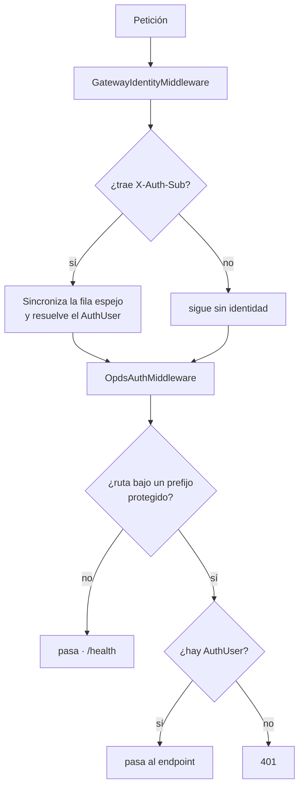

# 05 · Resolución de identidad

El backend **no autentica**. Recibe la identidad ya resuelta por el plugin del Gateway en
cabeceras HTTP y la refleja en su propia tabla de usuarios para poder colgar de ella el
progreso de lectura, las exclusiones y el control parental.

La capa de autenticación local —contraseñas PBKDF2, claves de API, login y reclamación del
servidor— se retiró del backend y vive ahora en el plugin.

## Los dos middlewares

### GatewayIdentityMiddleware

[GatewayIdentityMiddleware.cs](../../src/DiarSpeicher.Api/Middleware/GatewayIdentityMiddleware.cs)
traduce cabeceras a un `AuthUser` y mantiene el espejo.

| Cabecera                 | Destino                                   |
| ------------------------ | ----------------------------------------- |
| `X-Auth-Sub`             | `Id` · sin ella no se resuelve identidad  |
| `X-Auth-User`            | `Username` · si falta se usa el `Sub`     |
| `X-Auth-Role`            | `Roles`, separados por coma               |
| `X-Auth-Server-Owner`    | `IsServerOwner`                           |
| `X-Auth-Age-Restriction` | `AgeRestriction`                          |

**El espejo se crea just-in-time.** En la primera petición de un usuario desconocido se
inserta su fila; en las siguientes se reutiliza, y el nombre y la propiedad del servidor se
actualizan si el Gateway los cambió.

**El primero que entra queda como propietario del servidor**, aunque la cabecera no lo
diga: un servidor recién desplegado no tiene administrador hasta que alguien llega.

La restricción de edad y las bibliotecas excluidas se leen del espejo, no de las cabeceras,
porque son datos del dominio de medios que el Gateway no administra. La cabecera
`X-Auth-Age-Restriction`, si viene, tiene prioridad.

### OpdsAuthMiddleware

[OpdsAuthMiddleware.cs](../../src/DiarSpeicher.Api/Middleware/OpdsAuthMiddleware.cs) ya no
verifica credenciales. Comprueba que la identidad esté resuelta y extrae la clave de API de
la ruta para que los endpoints puedan construir los enlaces del feed.

Protege seis prefijos: `/opds`, `/api/v1`, `/api/v2`, `/koreader`, `/kobo` y `/graphql`.
Sin `AuthUser`, responde `401`.

`ExtractApiKey` sigue reconociendo la clave en el segmento de ruta
(`/opds/{key}/v1.2`, `/koreader/{key}`, `/kobo/{key}`), en `?api_key=` y en `X-Auth-Key`.
El backend **no la valida** —eso es del plugin—; la conserva en `HttpContext.Items` porque
los feeds OPDS deben repetirla en cada enlace que generan.

## Confianza en las cabeceras

El backend **no comprueba el origen** de las cabeceras `X-Auth-*`. Es una decisión
deliberada: el contenedor no publica su puerto y el Gateway es el único que puede
alcanzarlo, así que la garantía la da la topología del despliegue.

La contrapartida hay que tenerla presente: si ese puerto llegara a exponerse, cualquiera
podría enviar `X-Auth-Server-Owner: true` y obtener propiedad del servidor. No hay segunda
barrera.

## Lo que permanece en el backend

| Pieza                                     | Por qué                                          |
| ----------------------------------------- | ------------------------------------------------ |
| Tabla `User`                              | FK de `ReadingSession`, `LibraryExclusion`, `AgeRestriction` |
| `AgeRestriction` y `LibraryExclusion`     | Reglas de visibilidad del catálogo                |
| Filtrado `ForUser`                        | Lógica de dominio de medios                       |

Ver [MediaSqlFilters](../../src/DiarSpeicher.Infrastructure/Data/Extensions/MediaSqlFilters.cs)
para la variante en SQL de esas reglas.

## Campos sin consumidor

Quedan en el modelo y nadie los escribe. Son huecos previstos o restos:

- **`Sessions`** está mapeada e indexada; nada del pipeline crea ni valida sesiones. Igual
  que `User.MaxSessionsAllowed`.
- **`User.OidcIssuerId`** y **`User.OidcEmail`**: el plugin administra OIDC, así que
  probablemente sobran aquí.
- **`User.Permissions`**: los permisos llegan por cabecera en cada petición.
