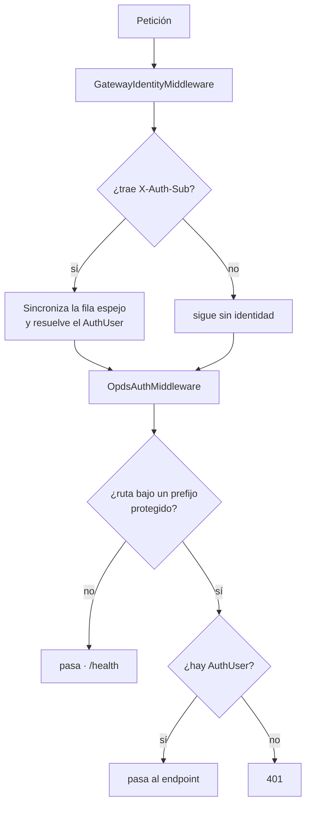

# 05 · Resolución de identidad

El backend **no autentica**. Recibe la identidad ya resuelta por el plugin del Gateway en
cabeceras HTTP y la refleja en su propia tabla de usuarios para poder colgar de ella el
progreso de lectura, las exclusiones y el control parental.

La capa de autenticación local —contraseñas PBKDF2, claves de API, login y reclamación del
servidor— se retiró del backend y vive ahora en el plugin.

## Los dos middlewares

### GatewayIdentityMiddleware

[GatewayIdentityMiddleware.cs](../../src/DiarSpeicher.Api/Middleware/GatewayIdentityMiddleware.cs)
traduce cabeceras a un `AuthUser` y mantiene el espejo.

| Cabecera                 | Destino                                   |
| ------------------------ | ----------------------------------------- |
| `X-Auth-Sub`             | `Id` · sin ella no se resuelve identidad  |
| `X-Auth-User`            | `Username` · si falta se usa el `Sub`     |
| `X-Auth-Role`            | `Roles`, separados por coma               |
| `X-Auth-Age`             | `AgeRestriction`                          |
| `X-Auth-Perms`           | `Permissions`, separados por coma         |

`IsServerOwner` **no sale de ninguna cabecera**: se concede en la base local al primer
usuario que la instancia ve y desde ahí solo cambia por la base de datos. nginx únicamente
borra las cabeceras que nombra una a una, así que cualquiera que no nombre llegaría tal cual
desde el cliente; que la propiedad del servidor no dependa de ninguna es deliberado.

**El espejo se crea just-in-time.** En la primera petición de un usuario desconocido se
inserta su fila; en las siguientes se reutiliza, y el nombre y la propiedad del servidor se
actualizan si el Gateway los cambió.

**El primero que entra queda como propietario del servidor**, aunque la cabecera no lo
diga: un servidor recién desplegado no tiene administrador hasta que alguien llega.

Las bibliotecas excluidas se leen del espejo, no de las cabeceras, porque son datos del
dominio de medios que el Gateway no administra. La edad sí la administra el Gateway —en la
columna `age_restriction` de `reader_user`, editable desde la pestaña de usuarios del panel—
y la cabecera `X-Auth-Age`, si viene, gana sobre el valor del espejo.

### OpdsAuthMiddleware

[OpdsAuthMiddleware.cs](../../src/DiarSpeicher.Api/Middleware/OpdsAuthMiddleware.cs) ya no
verifica credenciales. Comprueba que la identidad esté resuelta y extrae la clave de API de
la ruta para que los endpoints puedan construir los enlaces del feed.

Protege seis prefijos: `/opds`, `/api/v1`, `/api/v2`, `/koreader`, `/kobo` y `/graphql`.
Sin `AuthUser`, responde `401`.

`ExtractApiKey` sigue reconociendo la clave en el segmento de ruta
(`/opds/{key}/v1.2`, `/koreader/{key}`, `/kobo/{key}`), en `?api_key=` y en `X-Auth-Key`.
El backend **no la valida** —eso es del plugin—; la conserva en `HttpContext.Items` porque
los feeds OPDS deben repetirla en cada enlace que generan.

## Confianza en las cabeceras

El backend **no comprueba el origen** de las cabeceras `X-Auth-*`. Es una decisión
deliberada: el contenedor no publica su puerto y el Gateway es el único que puede
alcanzarlo, así que la garantía la da la topología del despliegue.

La contrapartida hay que tenerla presente: si ese puerto llegara a exponerse, cualquiera
podría enviar `X-Auth-Sub` con el identificador de otro usuario y suplantarlo. No hay segunda
barrera.

## Lo que permanece en el backend

| Pieza                                     | Por qué                                          |
| ----------------------------------------- | ------------------------------------------------ |
| Tabla `User`                              | FK de `ReadingSession`, `LibraryExclusion`, `AgeRestriction` |
| `AgeRestriction` y `LibraryExclusion`     | Reglas de visibilidad del catálogo                |
| Filtrado `ForUser`                        | Lógica de dominio de medios                       |

Ver [MediaSqlFilters](../../src/DiarSpeicher.Infrastructure/Data/Extensions/MediaSqlFilters.cs)
para la variante en SQL de esas reglas.

## Permisos

El Gateway guarda una lista de permisos por usuario (`reader_user.permissions`, CSV
editable desde la pestaña de usuarios del panel) y la inyecta en cada petición. El
middleware la trocea por comas en `AuthUser.Permissions` y `AuthUser.HasPermission`
decide. El vocabulario lo fijan dos ficheros que **deben decir lo mismo**:
[Permissions.cs](../../src/DiarSpeicher.Core/Domain/Models/Permissions.cs) y
`PERMISSION_GROUPS` en [endpoints.ts](../../frontEnd/src/api/endpoints.ts).

| Permiso              | Dónde se comprueba                                                    |
| -------------------- | ----------------------------------------------------------------------- |
| `FileUpload`         | `TusEndpoints` POST y PATCH · `StumpV2Service.UploadToLibraryAsync`, que cubre también la mutación `uploadBooks` |
| `CreateFolder`       | Los mismos dos, **solo si el subpath no existe todavía**                |
| `ManageLibrary`      | `POST /api/v2/libraries`                                                |
| `ScanLibrary`        | `POST /api/v2/libraries/{id}/scan` y la mutación `scanLibrary`          |
| `AccessKoreaderSync` | Filtro de grupo sobre `/koreader/{apiKey}`                              |
| `AccessKoboSync`     | Filtro de grupo sobre `/kobo/{apiKey}`                                  |
| `AccessApiKeys`      | Nada aquí: lo comprueba el propio Gateway antes de emitir identidad     |

Dos reglas que conviene tener presentes antes de tocar nada:

**El propietario del servidor está exento.** `HasPermission` devuelve `true` para él sin
mirar la lista, igual que `HasRole`. Sin esa exención una instancia recién desplegada se
quedaría sin nadie capaz de subir, porque los permisos por defecto del Gateway
(`AccessApiKeys,AccessKoreaderSync,AccessKoboSync`) **no incluyen `FileUpload`**.

**Ese mismo valor por defecto es la trampa de la migración.** Cualquier usuario que ya
existiera antes de esto y no sea el propietario se queda sin subir, sin crear bibliotecas y
sin escanear hasta que un administrador le marque las casillas. Las dos sincronizaciones no
se ven afectadas porque sí están en el valor por defecto. El comodín `*` vale por todos, y
lo entienden los dos lados.

Las reglas que no pasan por la cabecera son las del dominio de medios y viven en el espejo
local: `AgeRestriction` y `LibraryExclusion`, ambas a través de `ForUser`.

`X-Auth-App` y `X-Auth-Jti` siguen sin consumidor. `X-Auth-Role` se lee y aterriza en
`AuthUser.Roles`, pero ningún código de producción lo consulta: la única puerta de
privilegio que no viene de la cabecera es `IsServerOwner`.
