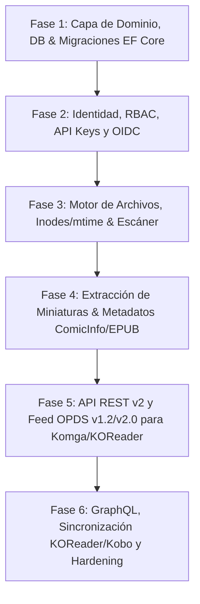

# Arquitectura y Diseño de DiarSpeicher (.NET 10) basado en Stump Core

## 1. Visión General del Proyecto
**DiarSpeicher** es una reimplementación de alto rendimiento en **.NET 10 / C# 13** del servidor de medios de cómics, manga y libros digitales **Stump** (originalmente escrito en Rust con Axum, SeaORM y Tokio).

El objetivo es proveer:
- Servidor REST/GraphQL moderno y modular.
- Soporte completo para protocolos de lectura estándar: **OPDS v1.2 / v2.0**, compatibilidad de sincronización con clientes como **Komga**, **KOReader** y **Kobo**.
- Motor de escaneo y monitoreo de archivos ultrarrápido con minimización de I/O mediante caché de timestamps (`mtime`) e inodes.
- Sistema de autenticación flexible: usuarios locales, API Keys y **OIDC (OpenID Connect / OAuth2)**.
- Modelo de permisos granulares y control de acceso multiusuario (exclusiones de biblioteca, restricciones de edad).

---

## 2. Mapa de Correspondencia Tecnológica: Rust -> .NET 10

| Componente en Stump (Rust) | Componente en DiarSpeicher (.NET 10) |
|---|---|
| **Framework HTTP**: `axum 0.8`, `tower`, `tower-sessions` | **ASP.NET Core Web API (Minimal APIs o Controllers)** con middleware pipeline nativo y `Microsoft.AspNetCore.Session` / Cookie Auth / JWT Bearer. |
| **ORM / Acceso a Datos**: `sea-orm 1.1`, SQLite | **Entity Framework Core 10** (`Microsoft.EntityFrameworkCore.Sqlite`) con DbContext y Fluent API. |
| **GraphQL**: `async-graphql` | **HotChocolate 14+** (.NET GraphQL Server). |
| **Autenticación OIDC**: `openidconnect`, PKCE flow | **Duende.BFF / Microsoft.AspNetCore.Authentication.OpenIdConnect** o cliente OIDC con `IdentityModel`. |
| **Hashing de Contraseñas**: `bcrypt` | **Argon2id** o `Microsoft.AspNetCore.Identity.PasswordHasher<T>` / `BCrypt.Net-Next`. |
| **Tokens / API Keys**: Custom hashing / Bearer | `Microsoft.AspNetCore.Authentication.JwtBearer` + Manejador custom para API Keys por cabecera `X-Auth-Key` / QueryParam `api_key`. |
| **Procesamiento de Archivos & Archivos Comprimidos**: `zip`, `unrar`, `tar` | `System.IO.Compression`, `SharpCompress` (rar/7z/cbr) para streaming directo de páginas sin descompresión en disco. |
| **Imágenes & Miniaturas**: `image-rs`, WebP | **ImageSharp (SixLabors)** o **SkiaSharp** (alto rendimiento, soporte WebP, JPEG, BlurHash/ThumbHash). |
| **Metadatos de Libros**: `quick-xml` (ComicInfo.xml), `epub` parser | `System.Xml.Linq` / `XmlSerializer` para ComicInfo.xml, `VersOne.Epub` para parsing nativo de EPUBs. |
| **Jobs en Segundo Plano**: Canales tokio / MPSC + SeaORM Job entity | **System.Threading.Channels** + **BackgroundService (`IHostedService`)** o **Quartz.NET / Hangfire** con persistencia en DB. |

---

## 3. Plan de Fases de Implementación (.NET 10)

### Fase 1: Dominio, Base de Datos y Persistencia (EF Core 10)
- Modelado de entidades maestras:
  - `User`, `UserPreferences`, `AgeRestriction`, `ApiKey`, `Session`.
  - `Library`, `LibraryConfig`, `LibraryExclusion`, `ScannedDirectory`.
  - `Series`, `SeriesMetadata`, `Media`, `MediaMetadata`, `Tag`, `MediaTag`, `SeriesTag`.
  - `ReadingSession`, `Bookmark`, `ReadingList`, `ReadingListItem`.
- Configuración de índices únicos, claves foráneas, borrado lógico (`deleted_at`) y converters de tipos (ej. listas de permisos serializadas como string/flags).
- Generación de migraciones iniciales (`dotnet ef migrations add InitialCreate`).

### Fase 2: Autenticación, Usuarios, Roles y OIDC
- Autenticación híbrida:
  - Sesión / Cookie para Web SPA.
  - JWT Bearer para clientes móviles y desktop.
  - API Key en Headers (`X-Auth-Key`) o URL query (`?api_key=...`) para lectores OPDS (Komga/KOReader).
- Proveedor OIDC:
  - Endpoint `/api/v2/auth/oidc/authorize` con soporte PKCE.
  - Endpoint `/api/v2/auth/oidc/callback` que sincroniza o aprovisiona usuarios automáticamente mapeando claims (`sub`, `email`, `preferred_username`).
- Sistema de permisos `UserPermission` y middleware de autorización (`[Authorize(Policy = "...")]`).

### Fase 3: Detección de Archivos, Algoritmo de Inodes/mtime y Escaneo
- Implementación de `DirectoryListing` y `DirectoryScanner`:
  - Recorrido no bloqueante con `FileSystemEnumerable`.
  - Mantenimiento de tabla `scanned_directories` con `last_mtime` (o FileSystemWatcher con soporte de inotify en Linux) para omitir directorios inalterados sin inspeccionar cada archivo.
  - Detección de cambios: creación de series nuevas, marcado de series/libros como `MISSING`, y reconciliación automática si reaparecen (`RECOVERED`).
- Pipeline de background jobs con canal reactivo (`Channel<ScanTask>`) para no saturar I/O.

### Fase 4: Descompresión en Streaming, Miniaturas y Metadatos
- Drivers de contenedores de cómics:
  - ZIP / CBZ (`System.IO.Compression.ZipArchive`).
  - RAR / CBR / 7Z (`SharpCompress`).
  - EPUB (`VersOne.Epub`).
  - PDF (PdfPig / SkiaSharp).
- Extracción bajo demanda de páginas concretas y miniaturas (`/api/v2/media/{id}/page/{page}`).
- Parser de `ComicInfo.xml` y metadatos OPF de EPUB para poblar `MediaMetadata` y `SeriesMetadata`.

### Fase 5: API REST y Compatibilidad con Clientes (OPDS / Komga)
- Implementación de endpoints REST v2 (`/api/v2/media`, `/api/v2/series`, `/api/v2/libraries`).
- Endpoint OPDS v1.2 XML feed compatible con lectores estándar (Chunky, Panels, Moon+ Reader, Kuro Reader).
- Emulación del feed y estructura esperada por clientes estilo Komga.

### Fase 6: KOReader Sync, Kobo Sync y Optimizaciones
- Protocolo de sincronización de progreso de lectura KOReader (`koreader_hash`).
- Sincronización de Kobo (`/kobo/...`).
- Métricas, compresión HTTP, streaming HTTP con soporte de `Range: bytes` y caché HTTP (ETag, Last-Modified).
