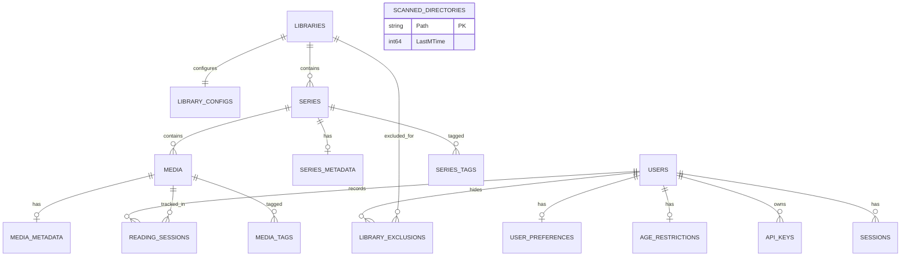

# Base de Datos, Entidades y Relaciones (Stump -> EF Core 10)

## 1. Mapeo de Tablas Principales de Stump

Stump utiliza **SeaORM** con SQLite. En C# / EF Core 10, mapeamos cada una de las tablas del crate `stump/crates/models/src/entity/` sobre **SQLite (WAL)**.



---

## 2. Definición Detallada de Entidades en C# (EF Core 10)

### 2.1 Usuarios y Acceso (`users`, `user_preferences`, `age_restrictions`, `api_keys`)

#### `User.cs`
- Corresponde a: `stump/crates/models/src/entity/user.rs`
```csharp
public class User
{
    public string Id { get; set; } = Ulid.NewUlid().ToString(); // O Guid
    public string Username { get; set; } = null!;
    public string HashedPassword { get; set; } = null!;
    public bool IsServerOwner { get; set; }
    public bool IsLocked { get; set; }
    public int? MaxSessionsAllowed { get; set; }

    public string? AvatarPath { get; set; }
    public string? AvatarMetaJson { get; set; }
    public DateTimeOffset? AvatarUpdatedAt { get; set; }

    public DateTimeOffset CreatedAt { get; set; } = DateTimeOffset.UtcNow;
    public DateTimeOffset? DeletedAt { get; set; }

    // Permisos serializados separados por comas: "ACCESS_API_KEYS,EMAIL_SEND"
    public string? Permissions { get; set; }

    // OIDC Integration
    public string? OidcIssuerId { get; set; }
    public string? OidcEmail { get; set; }

    // Relaciones
    public int? UserPreferencesId { get; set; }
    public UserPreferences? Preferences { get; set; }

    public AgeRestriction? AgeRestriction { get; set; }
    public ICollection<ApiKey> ApiKeys { get; set; } = new List<ApiKey>();
    public ICollection<Session> Sessions { get; set; } = new List<Session>();
    public ICollection<LibraryExclusion> ExcludedLibraries { get; set; } = new List<LibraryExclusion>();
    public ICollection<ReadingSession> ReadingSessions { get; set; } = new List<ReadingSession>();
}
```

#### `UserPreferences.cs`
- Corresponde a: `stump/crates/models/src/entity/user_preferences.rs`
- Contiene: Tema (`theme`), idioma (`locale`), modo de lectura preferido (`reading_mode`: Paged, ContinuousVertical), orden de navegación, etc.

#### `AgeRestriction.cs`
- Corresponde a: `stump/crates/models/src/entity/age_restriction.rs`
- Campos: `Id`, `UserId`, `Age` (ej. 13, 18), `RestrictOnUnset` (bool - si los libros sin clasificación explícita quedan bloqueados).

#### `ApiKey.cs`
- Corresponde a: `stump/crates/models/src/entity/api_key.rs`
- Campos: `Id`, `UserId`, `KeyHash` (hash para validación rápida), `Name`, `ExpiresAt`, `CreatedAt`.

---

### 2.2 Bibliotecas y Series (`libraries`, `library_configs`, `series`, `series_metadata`)

#### `Library.cs`
- Corresponde a: `stump/crates/models/src/entity/library.rs`
```csharp
public class Library
{
    public string Id { get; set; } = Ulid.NewUlid().ToString();
    public string Name { get; set; } = null!;
    public string? Description { get; set; }
    public string Path { get; set; } = null!; // Ruta absoluta en disco
    public FileStatus Status { get; set; } = FileStatus.Ready; // READY, MISSING, ERROR
    public string? Emoji { get; set; }
    public string? ThumbnailPath { get; set; }
    public DateTimeOffset CreatedAt { get; set; } = DateTimeOffset.UtcNow;
    public DateTimeOffset? UpdatedAt { get; set; }
    public DateTimeOffset? LastScannedAt { get; set; }

    public int ConfigId { get; set; }
    public LibraryConfig Config { get; set; } = null!;

    public ICollection<Series> Series { get; set; } = new List<Series>();
    public ICollection<LibraryExclusion> ExcludedUsers { get; set; } = new List<LibraryExclusion>();
}
```

#### `LibraryConfig.cs`
- Corresponde a: `stump/crates/models/src/entity/library_config.rs`
- Controla:
  - `LibraryPattern`: `SeriesBased` vs `CollectionBased`.
  - `LibraryType`: Comic, Manga, Book.
  - `IgnoreRules`: Patrones glob para ignorar archivos/carpetas.
  - `ThumbnailConfig`: Dimensiones, formato y generador.

#### `Series.cs` y `SeriesMetadata.cs`
- Corresponde a: `stump/crates/models/src/entity/series.rs` y `series_metadata.rs`
- Campos de `Series`: `Id`, `Name`, `Path`, `Status`, `LibraryId`, `CreatedAt`, `UpdatedAt`.
- Campos de `SeriesMetadata`: `SeriesId`, `Title`, `Summary`, `Publisher`, `Status` (Ongoing, Completed, etc.), `AgeRating`, `Volume`, `TotalIssues`.

---

### 2.3 Libros y Medios (`media`, `media_metadata`, `scanned_directories`)

#### `Media.cs` (Libros/Capítulos)
- Corresponde a: `stump/crates/models/src/entity/media.rs`
```csharp
public class Media
{
    public string Id { get; set; } = Ulid.NewUlid().ToString();
    public string Name { get; set; } = null!;
    public long Size { get; set; }
    public string Extension { get; set; } = null!; // cbz, cbr, epub, pdf, etc.
    public int Pages { get; set; }
    public string Path { get; set; } = null!; // Ruta absoluta del fichero
    public FileStatus Status { get; set; } = FileStatus.Ready;

    public string? Hash { get; set; } // Stump hash (detección de duplicados)
    public string? KoreaderHash { get; set; } // Hash compatible con KOReader sync

    public string? ThumbnailPath { get; set; }
    public DateTimeOffset CreatedAt { get; set; } = DateTimeOffset.UtcNow;
    public DateTimeOffset? UpdatedAt { get; set; }
    public DateTimeOffset? ModifiedAt { get; set; } // mtime del fichero
    public DateTimeOffset? DeletedAt { get; set; } // Soft delete

    public string? SeriesId { get; set; }
    public Series? Series { get; set; }

    public MediaMetadata? Metadata { get; set; }
    public ICollection<ReadingSession> ReadingSessions { get; set; } = new List<ReadingSession>();
}
```

#### `MediaMetadata.cs`
- Corresponde a: `stump/crates/models/src/entity/media_metadata.rs`
- Extraído típicamente de `ComicInfo.xml` o metadata OPF de EPUB:
  - `Title`, `Summary`, `Number` (ej. volumen o número de issue), `Year`, `Month`, `Day`.
  - `Writers`, `Pencillers`, `Inkers`, `Colorists`, `Letterers`, `CoverArtists`.
  - `AgeRating` (usado por el filtro de control parental de usuarios).
  - `PageCount`.

#### `ScannedDirectory.cs` (Caché de MTime / Inodes para Escaneo Ultrarrápido)
- Corresponde a: `stump/crates/models/src/entity/scanned_directory.rs`
```csharp
public class ScannedDirectory
{
    public string Path { get; set; } = null!; // Primary Key
    public long LastMTime { get; set; } // Timestamp UNIX de última modificación del directorio
}
```

---

## 3. Reglas de Filtrado de Acceso (Query Filters de SeaORM -> EF Core)

En Stump, cada consulta de libros o bibliotecas pasa por filtros de seguridad basados en el usuario:
1. **Exclusiones de biblioteca (`LibraryExclusion`)**: Si un usuario tiene la biblioteca oculta, ningún elemento hijo (`Series`, `Media`) se incluye en la respuesta.
2. **Restricción de edad (`AgeRestriction`)**:
   - Si `RestrictOnUnset = true`, los libros sin `AgeRating` en `MediaMetadata` ni `SeriesMetadata` quedan bloqueados.
   - Si tiene `AgeRating`, debe cumplirse: `media.Metadata.AgeRating <= user.AgeRestriction.Age`.
3. **Soft Delete**: `DeletedAt == null`.

En EF Core 10 esto se implementa limpiamente mediante **Global Query Filters** o métodos de extensión IQueryable:
```csharp
public static IQueryable<Media> ForUser(this IQueryable<Media> query, User user)
{
    var q = query.Where(m => m.DeletedAt == null);

    // 1. Ocultar bibliotecas excluidas
    q = q.Where(m => !m.Series!.Library!.ExcludedUsers.Any(e => e.UserId == user.Id));

    // 2. Control parental
    if (user.AgeRestriction != null)
    {
        var minAge = user.AgeRestriction.Age;
        if (user.AgeRestriction.RestrictOnUnset)
        {
            q = q.Where(m =>
                (m.Metadata != null && m.Metadata.AgeRating != null && m.Metadata.AgeRating <= minAge) ||
                (m.Metadata == null && m.Series!.Metadata != null && m.Series.Metadata.AgeRating <= minAge));
        }
        else
        {
            q = q.Where(m =>
                m.Metadata == null ||
                m.Metadata.AgeRating == null ||
                m.Metadata.AgeRating <= minAge);
        }
    }

    return q;
}
```
