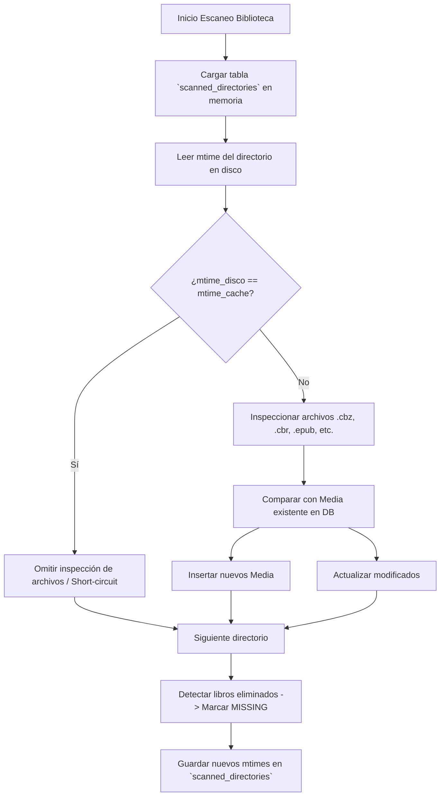

# Motor de Escaneo de Archivos, MTime e Inodes

El escaneo de bibliotecas de cómics y libros con miles de archivos debe ser instantáneo y no saturar el disco. Stump utiliza un algoritmo sofisticado de verificación de marcas de tiempo (`mtime`) de directorios y reconciliación de entidades.

---

## 1. Ficheros de Referencia en Rust
- Orquestador del Job: `stump/core/src/filesystem/scanner/library_scan_job.rs`
- Recorrido del Árbol de Directorios: `stump/core/src/filesystem/scanner/walk.rs`
- Utilidades y Reconciliación: `stump/core/src/filesystem/scanner/utils.rs`
- Watcher de Archivos: `stump/core/src/filesystem/scanner/library_watcher.rs`
- Entidad de Caché: `stump/crates/models/src/entity/scanned_directory.rs`

---

## 2. El Problema de Escanear Directorios Grandes y la Solución con MTime

En sistemas de archivos estándar (ext4, NTFS, APFS), el **tiempo de modificación de un directorio (`mtime`) cambia cada vez que se añade, elimina o renombra un fichero o subdirectorio dentro de él**.

### Estrategia de Stump
1. Al iniciar el escaneo de una biblioteca, carga en memoria una tabla asociativa `dir_mtimes: HashMap<Path, u64>` desde la tabla `scanned_directories`.
2. Al descender por el árbol de directorios con `WalkDir`:
   - Lee el `mtime` del directorio actual.
   - Si `mtime_actual == mtime_almacenado`, **se omite completamente el procesamiento de los ficheros del directorio** (estado `Skipped`).
   - Si `mtime_actual != mtime_almacenado` o es un directorio nuevo:
     - Se inspecciona cada archivo dentro de él.
     - Al finalizar el escaneo, se actualiza el nuevo timestamp en lote en `scanned_directories`.



---

## 3. Estados de los Ficheros y Reconciliación (`FileStatus`)

Los libros y series en la base de datos no se borran físicamente si desaparecen de repente del disco (para no perder el historial de lectura, marcadores ni notas del usuario):

| Estado en Stump | Significado | Transición |
|---|---|---|
| `READY` | El archivo existe y es accesible en disco. | Escaneo inicial exitoso. |
| `MISSING` | El archivo ya no se encuentra en la ruta esperada. | El escáner no encuentra el archivo -> Marca como `MISSING`. |
| `RECOVERED` | Un archivo que estaba marcado como `MISSING` vuelve a estar presente. | El escáner detecta que reapareció -> Vuelve a marcarse como `READY`. |
| `ERROR` | El archivo está corrupto o no se puede leer (ej. zip roto). | El parser falla al abrir el archivo. |
| `UNSUPPORTED` | Extensión desconocida o no soportada. | Ignorado por el filtro de tipo de contenido. |

---

## 4. Implementación en .NET 10 (C#)

### 4.1 Uso de `FileSystemEnumerable` de Alto Rendimiento
En .NET, `Directory.GetFiles()` asigna arrays de strings que generan presión en el Garbage Collector (GC). Para emular el rendimiento de Rust:
```csharp
public class LibraryScanner
{
    private readonly ApplicationDbContext _db;
    private readonly ILogger<LibraryScanner> _logger;

    public async Task ScanLibraryAsync(string libraryId, CancellationToken ct)
    {
        var library = await _db.Libraries
            .Include(l => l.Config)
            .FirstOrDefaultAsync(l => l.Id == libraryId, ct);

        if (library == null || !Directory.Exists(library.Path)) return;

        // 1. Cargar mtimes en memoria
        var cachedMtimes = await _db.ScannedDirectories
            .ToDictionaryAsync(d => d.Path, d => d.LastMTime, ct);

        var pendingMtimes = new List<ScannedDirectory>();

        // 2. Enumerador de bajo consumo de memoria
        var dirOptions = new EnumerationOptions
        {
            RecurseSubdirectories = true,
            IgnoreInaccessible = true,
            AttributesToSkip = FileAttributes.Hidden | FileAttributes.System
        };

        var rootDirInfo = new DirectoryInfo(library.Path);
        foreach (var dir in rootDirInfo.EnumerateDirectories("*", SearchOption.AllDirectories))
        {
            ct.ThrowIfCancellationRequested();
            var dirPath = dir.FullName;
            var currentMtime = new DateTimeOffset(dir.LastWriteTimeUtc).ToUnixTimeSeconds();

            if (cachedMtimes.TryGetValue(dirPath, out var lastMtime) && lastMtime == currentMtime)
            {
                // Subárbol inalterado: saltar análisis de ficheros
                continue;
            }

            // Procesar ficheros del directorio
            await ProcessDirectoryFilesAsync(dir, library, ct);

            // Registrar nuevo mtime
            pendingMtimes.Add(new ScannedDirectory { Path = dirPath, LastMTime = currentMtime });
        }

        // 3. Batch upsert de mtimes
        await _db.BulkInsertOrUpdateAsync(pendingMtimes, ct);
        
        library.LastScannedAt = DateTimeOffset.UtcNow;
        await _db.SaveChangesAsync(ct);
    }
}
```

### 4.2 Detección de Cambios en Tiempo Real (Inotify en Linux / FileSystemWatcher)
En Rust, `library_watcher.rs` utiliza la crate `notify`. En .NET 10 en Linux:
- `FileSystemWatcher` utiliza internamente `inotify` del kernel Linux.
- Se debe implementar un debouncing (ej. acumular eventos durante 5-10 segundos) antes de disparar el reescaneo de la serie o directorio afectado para evitar reescaneos repetitivos mientras se copian archivos grandes.
