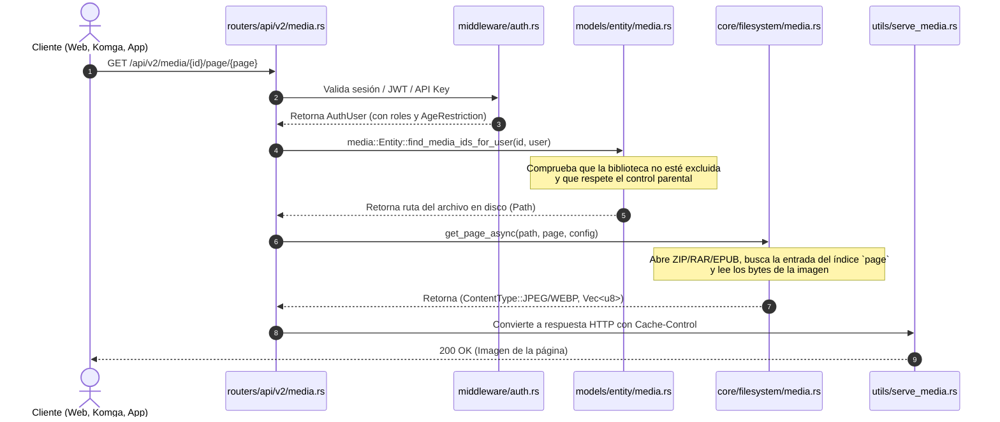

# Extracción del Flujo de Libros: De Rust a .NET 10

Este documento responde específicamente al requerimiento de trazabilidad:
> *"para obtener mis libros en rust se usan los siguientes ficheros el flujo es..."*

A continuación se desglosan los ficheros exactos de Rust, cómo viaja la petición y cómo se emula dicho comportamiento en **.NET 10**.

---

## 1. Mapeo de Ficheros en Rust para "Obtener mis Libros"

| Función en el Flujo | Ficheros en Rust (Stump) | Responsabilidad |
|---|---|---|
| **Rutas & Endpoints** | `stump/apps/server/src/routers/api/v2/media.rs` | Expone `/api/v2/media/{id}`, `/page/{page}`, `/thumbnail`, `/file`. Valida autenticación con `auth_middleware`. |
| **Filtros & Permisos** | `stump/crates/models/src/entity/media.rs` | Aplica `apply_library_hidden_filter` y `apply_age_restriction_filter` sobre la consulta SeaORM. |
| **Extracción de Páginas** | `stump/core/src/filesystem/media/mod.rs` y `process.rs` | Abre el contenedor (`.cbz`, `.cbr`, `.epub`, `.pdf`) y extrae la página solicitada o miniatura en memoria. |
| **Respuesta HTTP / Streaming** | `stump/apps/server/src/utils/serve_media.rs` | Maneja cabeceras HTTP `Content-Type`, `Range: bytes`, streaming eficiente sin cargar todo el archivo en RAM. |
| **Catálogo OPDS (Komga)**| `stump/apps/server/src/routers/opds/v1_2.rs` | Genera feed XML (`/opds/v1.2/books` o `/opds/{api_key}/v1.2/books`) para lectores externos. |

---

## 2. Flujo Paso a Paso en Rust



---

## 3. Emulación del Flujo en .NET 10 (C#)

### 3.1 Controlador o Minimal API (`MediaEndpoints.cs`)
```csharp
app.MapGet("/api/v2/media/{id}/page/{page:int}", async (
    string id,
    int page,
    ClaimsPrincipal userPrincipal,
    ApplicationDbContext db,
    IBookContentService bookService,
    CancellationToken ct) =>
{
    var currentUserId = userPrincipal.FindFirstValue(ClaimTypes.NameIdentifier);
    var user = await db.Users
        .Include(u => u.AgeRestriction)
        .Include(u => u.ExcludedLibraries)
        .FirstOrDefaultAsync(u => u.Id == currentUserId, ct);

    if (user == null) return Results.Unauthorized();

    // 1. Consulta segura con filtrado de acceso
    var book = await db.Media
        .ForUser(user)
        .Where(m => m.Id == id)
        .Select(m => new { m.Id, m.Path, m.Extension })
        .FirstOrDefaultAsync(ct);

    if (book == null) return Results.NotFound("Libro no encontrado o sin permisos.");

    // 2. Extracción de página bajo demanda en streaming
    var (contentType, stream) = await bookService.GetPageStreamAsync(book.Path, book.Extension, page, ct);

    // 3. Respuesta con soporte de caché HTTP ETag / 304 Not Modified
    return Results.Stream(stream, contentType: contentType, enableRangeProcessing: true);
})
.RequireAuthorization();
```

### 3.2 Servicio de Extracción (`BookContentService.cs`)
```csharp
public class BookContentService : IBookContentService
{
    public async Task<(string ContentType, Stream Stream)> GetPageStreamAsync(
        string filePath, 
        string extension, 
        int pageNumber, 
        CancellationToken ct)
    {
        switch (extension.ToLowerInvariant())
        {
            case "cbz":
            case "zip":
                return await ExtractPageFromZipAsync(filePath, pageNumber, ct);
            case "cbr":
            case "rar":
                return await ExtractPageFromRarAsync(filePath, pageNumber, ct);
            case "epub":
                return await ExtractPageFromEpubAsync(filePath, pageNumber, ct);
            default:
                throw new NotSupportedException($"Formato {extension} no soportado");
        }
    }

    private async Task<(string ContentType, Stream Stream)> ExtractPageFromZipAsync(
        string zipPath, int page, CancellationToken ct)
    {
        var archive = ZipFile.OpenRead(zipPath);
        // Filtrar entradas de imagen (.jpg, .png, .webp) ordenadas alfanuméricamente
        var imageEntries = archive.Entries
            .Where(e => IsImageFile(e.FullName))
            .OrderBy(e => e.FullName, StringComparer.OrdinalIgnoreCase)
            .ToList();

        if (page < 1 || page > imageEntries.Count)
            throw new IndexOutOfRangeException($"Página {page} fuera de rango.");

        var entry = imageEntries[page - 1];
        var memoryStream = new MemoryStream();
        await using (var entryStream = entry.Open())
        {
            await entryStream.CopyToAsync(memoryStream, ct);
        }
        memoryStream.Position = 0;

        return (GetMimeType(entry.Name), memoryStream);
    }
}
```

---

## 4. Flujo de Catálogo OPDS para Lectores Externos y Komga

Para lectores externos que consultan libros mediante OPDS:
1. El cliente solicita `/opds/v1.2/catalog` o `/opds/{apiKey}/v1.2/books`.
2. El servidor valida la `apiKey` contra la tabla `api_keys`.
3. Se devuelven las entradas en XML Atom (`application/atom+xml;profile=opds-catalog`):
   - Enlace `rel="http://opds-spec.org/image/thumbnail"` -> Miniatura `/api/v2/media/{id}/thumbnail`.
   - Enlace `rel="http://opds-spec.org/acquisition"` -> Descarga del fichero completo `/api/v2/media/{id}/file`.
   - Enlace de flujo para navegación página a página.
