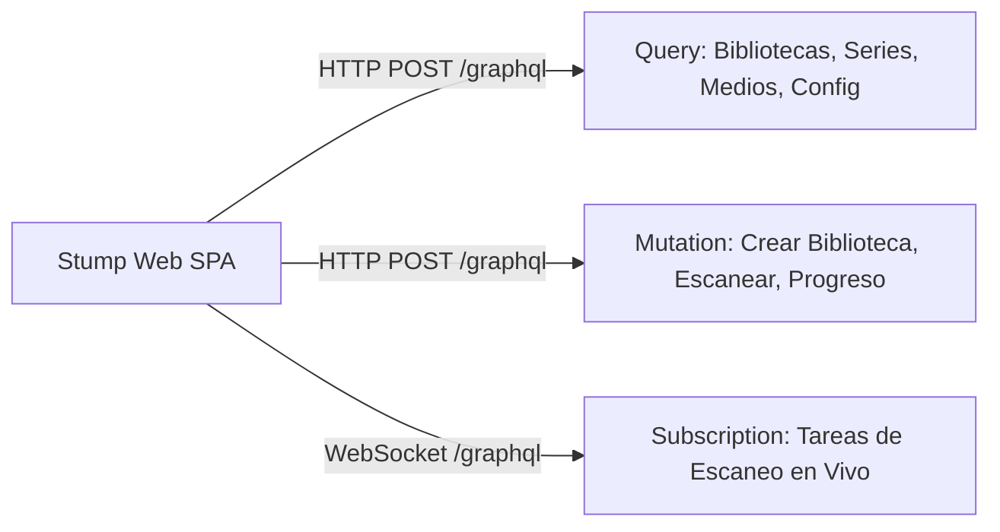

# API GraphQL con HotChocolate (Compatibilidad con Stump Web SPA)

## 1. Visión General

Para clientes web y paneles administrativos basados en la interfaz original de **Stump** (construida con React, TypeScript y Apollo/Urql GraphQL), DiarSpeicher integra un servidor GraphQL basado en **HotChocolate 14+ (.NET)** que expone el mismo esquema (`schema.graphql`) que el servidor Axum/async-graphql original.

---

## 2. Esquema GraphQL Principal

El esquema GraphQL se estructura en tres componentes principales:



### 1. Consultas (`QueryType`)
- `libraries(pagination, filter)`: Colección de bibliotecas accesibles por el usuario autenticado.
- `series(pagination, filter)`: Explorador de series con filtrado por biblioteca y metadatos.
- `media(pagination, filter)`: Consulta de libros individuales con ordenamiento por fecha o título.
- `readingSessions`: Libros actualmente en lectura (`keepReading`).
- `serverConfig`: Opciones del servidor (subida habilitada, límites de archivo, versión).

### 2. Mutaciones (`MutationType`)
- `createLibrary(input)` / `editLibrary(input)` / `deleteLibrary(id)`: Gestión de bibliotecas.
- `scanLibrary(id)`: Disparo de escaneos que se canaliza hacia `IScannerQueue`.
- `updateReadingProgress(input)`: Actualización del estado de lectura de libros.
- `uploadBooks(input)`: Mutación multipart para subida de cómics.

### 3. Suscripciones en Tiempo Real (`SubscriptionType`)
- `jobProgress(jobId)`: Eventos reactivos que informan del porcentaje de avance durante un escaneo de biblioteca a través de WebSockets.

---

## 3. Seguridad y Filtrado Perimetral en GraphQL

HotChocolate inyecta el `AuthUser` autenticado en el contexto de ejecución (`IResolverContext`):

```csharp
[Authorize]
public class LibraryQueries
{
    [UsePaging]
    [UseFiltering]
    [UseSorting]
    public IQueryable<Library> GetLibraries(
        [Service] DiarSpeicherDbContext db,
        [GlobalState("AuthUser")] AuthUser user)
    {
        return db.Libraries.ForUser(user);
    }
}
```

Cada resolución de campos de relación (ej. `series.media`) emplea **DataLoaders** de HotChocolate optimizados para evitar el problema de $N+1$ queries, garantizando que el filtrado `ForUser(user)` se mantenga estricto en cada nivel del árbol de ejecución.
