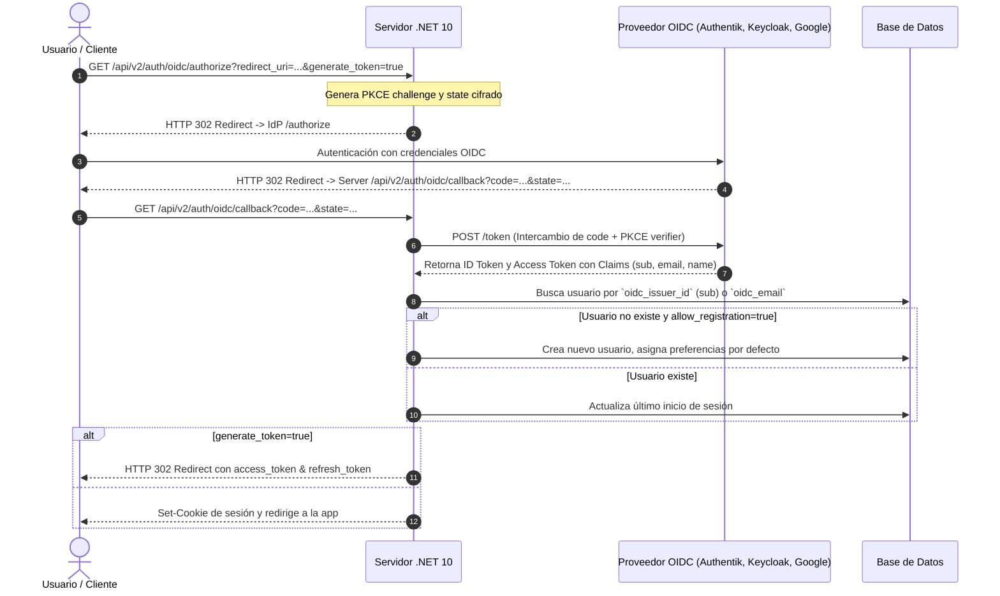

# Flujos de Autenticación, Usuarios, Permisos y OIDC

Este documento detalla la lógica de autenticación en Stump y cómo debe ser implementada en .NET 10 para soportar tanto aplicaciones web como clientes externos (Komga, KOReader, Kobo, etc.).

---

## 1. Métodos de Autenticación

Stump implementa 3 mecanismos de autenticación principales:

```
                  ┌────────────────────────────────────────────────────────┐
                  │                   Cliente / Petición                   │
                  └───────────────────────────┬────────────────────────────┘
                                              │
                    ┌─────────────────────────┼────────────────────────┐
                    │                         │                        │
             [Cookie / Sesión]          [Bearer / JWT]            [API Key]
                    │                         │                        │
         (Web App / Desktop)         (Mobile Apps / OIDC)    (Komga, OPDS, KOReader)
                    │                         │                        │
                    ▼                         ▼                        ▼
       ┌────────────────────────┐┌────────────────────────┐┌────────────────────────┐
       │   Session Middleware   ││    JWT Bearer Token    ││   ApiKey Middleware    │
       │ (tower_sessions / DB)  ││   (HMAC-SHA256 Auth)   ││ (Header / Query Param) │
       └────────────┬───────────┘└────────────┬───────────┘└────────────┬───────────┘
                    │                         │                         │
                    └─────────────────────────┼─────────────────────────┘
                                              ▼
                             ┌──────────────────────────────────┐
                             │       Resolved: `AuthUser`       │
                             │ (ID, Username, Owner, Perms,     │
                             │  AgeRestriction, Preferences)    │
                             └──────────────────────────────────┘
```

### 1.1 Sesión / Cookies
- **Uso en Stump**: Utiliza `tower_sessions` guardando una cookie de sesión en el navegador (`stump_session`).
- **En .NET 10**: Se utiliza `app.UseAuthentication()` con esquema de Cookies (`CookieAuthenticationDefaults.AuthenticationScheme`) o `Microsoft.AspNetCore.Session`.

### 1.2 JWT (JSON Web Tokens)
- **Uso en Stump**: Endpoint `/auth/login` o tras el flujo OIDC con parámetro `?generate_token=true`. Retorna un par `JwtTokenPair` (`access_token`, `refresh_token`).
- **En .NET 10**: Manejado nativamente con `services.AddAuthentication(JwtBearerDefaults.AuthenticationScheme).AddJwtBearer(...)`.

### 1.3 API Keys para Clientes Externos (Komga / OPDS)
- **Uso en Stump**: 
  - Cabecera HTTP: `X-Auth-Key: <key>`
  - Parámetro de ruta / URL: `/opds/{api_key}/v1.2/catalog`
- Permite que clientes de lectura como Chunky, Panels, Moon+ Reader o servidores estilo Komga sincronicen sin gestionar un flujo interactivo de login.

---

## 2. Flujo OIDC (OpenID Connect / OAuth2)

### Ficheros de Referencia en Rust
- Router OIDC: `stump/apps/server/src/routers/api/v2/oidc.rs`
- Cliente OpenID: `stump/apps/server/src/config/oidc.rs`
- Modelo de Usuario: `stump/crates/models/src/entity/user.rs` (`oidc_issuer_id`, `oidc_email`)

### Secuencia del Flujo OIDC



### Parámetros de Configuración OIDC
- `IssuerUrl`: URL base del proveedor (Keycloak, Authentik, etc.).
- `ClientId` y `ClientSecret`.
- `AllowRegistration`: Booleano para permitir auto-creación de usuarios en el primer login.
- `DisableLocalAuth`: Booleano para forzar el uso exclusivo de OIDC.

---

## 3. Sistema de Permisos y Roles (RBAC)

### Ficheros de Referencia en Rust
- Enums de Permisos: `stump/crates/models/src/shared/enums.rs` (`UserPermission`)
- Conjunto de Permisos: `stump/crates/models/src/shared/permission_set.rs` (`PermissionSet`)
- Extensiones de Auth: `stump/crates/models/src/entity/user.rs` (`AuthUser::has_permission`)

### Lista de Permisos (`UserPermission`)
1. **Acceso y Claves**:
   - `AccessApiKeys`: Crear y revocar sus propias API keys.
2. **Sincronización de Lectura**:
   - `AccessKoreaderSync`: Sincronizar progreso con lectores KOReader.
   - `AccessKoboSync`: Sincronizar libros y progreso con e-readers Kobo.
3. **Gestión de Perfil**:
   - `ChangePassword`, `ChangeUsername`, `ChangeAvatar`.
4. **Club de Lectura y Listas**:
   - `AccessBookClub`, `CreateBookClub`, `AccessSmartList`.
5. **Servicios de Correo**:
   - `EmailerRead`, `EmailerCreate`, `EmailerManage`, `EmailSend`.
6. **Administración de Bibliotecas**:
   - `ManageLibrary`: Crear, editar, eliminar o re-escanear bibliotecas.
   - `FileDownload`: Descargar los archivos originales CBZ/EPUB.

### Lógica de Validación en C# (.NET 10)
En C#, el `AuthUser` se mapea a un `ClaimsPrincipal`:
```csharp
public class AuthUser
{
    public string Id { get; set; } = null!;
    public string Username { get; set; } = null!;
    public bool IsServerOwner { get; set; }
    public HashSet<string> Permissions { get; set; } = new();
    public AgeRestriction? AgeRestriction { get; set; }

    public bool HasPermission(string permission)
    {
        // El Server Owner siempre tiene acceso total
        return IsServerOwner || Permissions.Contains(permission);
    }
}
```
Y se integra como **Policy** de autorización en ASP.NET Core:
```csharp
builder.Services.AddAuthorization(options =>
{
    options.AddPolicy("RequireApiKeyAccess", policy =>
        policy.RequireAssertion(ctx => 
            ctx.User.HasClaim("IsServerOwner", "true") || 
            ctx.User.HasClaim("Permission", "AccessApiKeys")));
});
```
